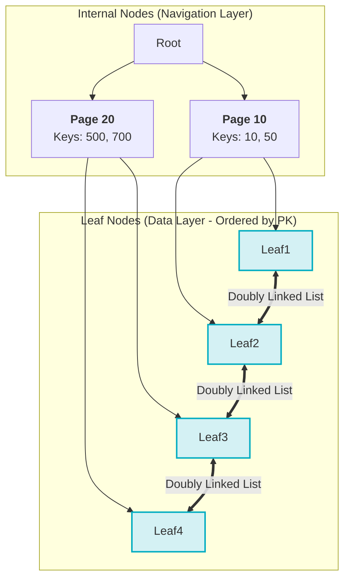
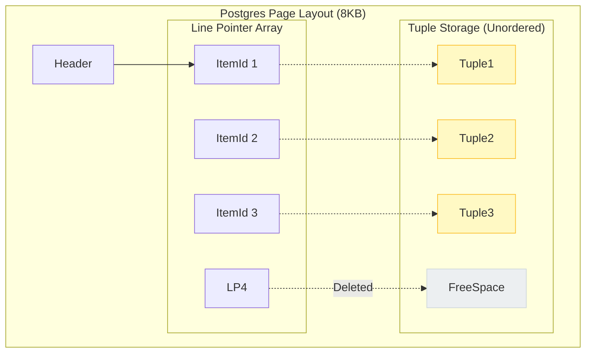
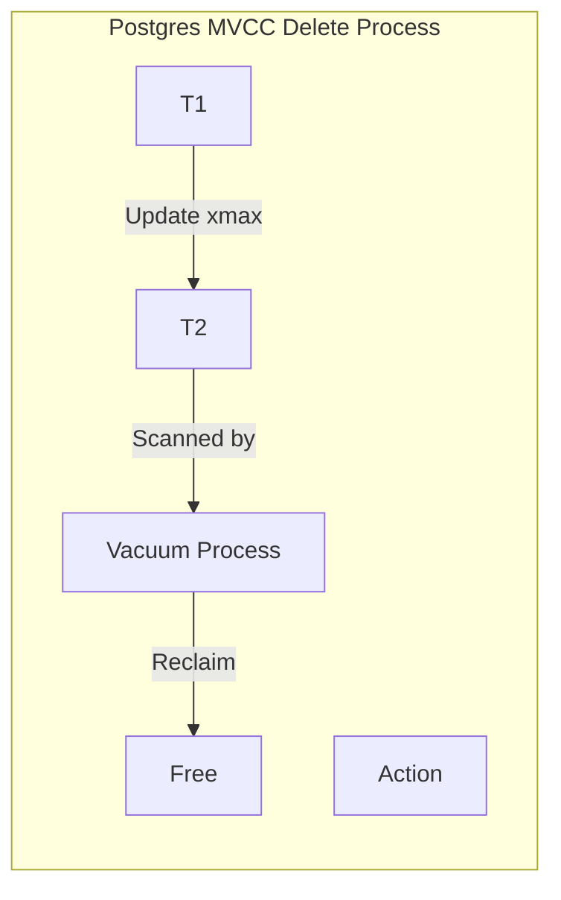
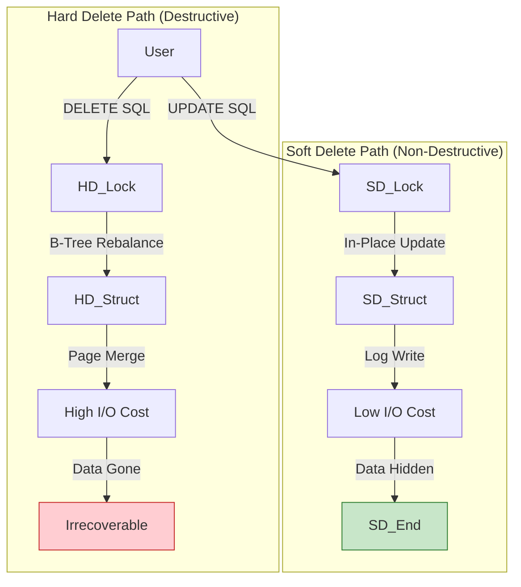

# Hard Deletes: A Deep Dive into Database Storage Engines and Soft Deletion Strategies

## Summary

In the discipline of database architecture, the mechanism of deletion is frequently underestimated. While the creation and retrieval of data receive significant attention regarding optimization and structure, the removal of data—specifically the "Hard Delete"—is often treated as a trivial housekeeping operation. However, an exhaustive analysis of storage engine internals reveals that hard deletion is one of the most resource-intensive and structurally disruptive operations in a relational database management system (RDBMS).

This report provides a comprehensive technical analysis of the storage engines underpinning major databases, specifically MySQL's InnoDB and PostgreSQL's Heap architecture. It articulates the high costs associated with physical record removal, including B+ Tree rebalancing, locking contention, input/output (I/O) thrashing, and vacuum-induced bloat. Consequently, this document advocates for a "Soft Delete by Design" methodology, treating deletion as a logical state transition rather than a physical storage event. It concludes with a robust lifecycle management strategy that couples logical soft deletion with asynchronous, batched hard deletion to maintain long-term storage hygiene without compromising system stability.

## 1\. Storage Engine Internals

To comprehend the catastrophic potential of a hard delete, one must first possess a nuanced understanding of how data resides on the disk. The abstraction of a "table" composed of "rows" and "columns" is a logical convenience; the physical reality is a complex arrangement of binary pages, pointers, and trees.

### **1.1 MySQL InnoDB: The Index-Organized Table**

In the MySQL ecosystem, the default storage engine is InnoDB. Its defining characteristic is that it does not merely use an index to find data; the table *is* the index. This architecture is known as a Clustered Index, implemented via a B+ Tree data structure.

#### **1.1.1 The B+ Tree Hierarchy**The Lifecycle Strategy

The B+ Tree is a self-balancing tree structure designed to maintain sorted data and allow searches, sequential access, insertions, and deletions in logarithmic time. It is distinct from a binary tree in its high fan-out; a single node can have hundreds of children, allowing the tree to remain incredibly shallow (usually 3 to 4 levels deep) even for tables containing billions of rows.

* **The Root Page:** The entry point of the tree. It resides at a fixed location and contains pointers to internal nodes.
* **Internal Nodes (Non-Leaf):** These nodes act as the navigational roadmap. They contain only the Primary Key values and pointers to child pages. Because they do not store the full row data, they are lightweight. A single 16KB page can store hundreds of keys, maximizing the "fan-out" capability and ensuring that traversing the tree requires minimal disk I/O.
* **Leaf Nodes (The Data):** This is where the physical reality of the Clustered Index becomes apparent. The leaf nodes contain the actual row data—every column of every record.

#### **1.1.2 Primary Key Ordering in Leaf Nodes**

A critical architectural feature of InnoDB is that the leaf nodes are strictly ordered by the Primary Key. This is not a suggestion; it is a physical enforcement. If a table has a Primary Key of ID, the row with ID=1 is physically stored adjacent to ID=2 within the 16KB page.

Furthermore, these leaf nodes are strictly linked in a doubly linked list. Each leaf page contains a pointer to the previous page and the next page. This structure enables the database to perform extremely fast range scans (e.g., SELECT \* FROM orders WHERE id BETWEEN 100 AND 200\) by traversing the linked list rather than returning to the root node.

#### **1.1.3 Page Filling and Fragmentation**

InnoDB manages storage in units called Pages, typically 16KB in size. When records are inserted sequentially (e.g., using an auto-incrementing integer), InnoDB fills these pages efficiently, leaving only a small fraction (typically 1/16th) free for future modifications. This results in a "Fill Factor" of nearly 100%, ensuring optimal disk usage and cache efficiency.

However, when data is modified or deleted, this order is disturbed. A hard delete creates a physical "hole" in the page. If enough holes are created, the page density drops, leading to fragmentation—a state where the database engine is caching and reading pages that are largely empty air.

**Table 1: B+ Tree Node Characteristics**

| Node Type | Content | Purpose | Density |
| :---- | :---- | :---- | :---- |
| **Internal Node** | Primary Keys \+ Child Pointers | Navigation | High (Keys only) |
| **Leaf Node** | Full Row Data | Storage | Variable (Depends on Row Size) |
| **Leaf Linkage** | Double Pointers (Prev/Next) | Range Scans | N/A |




### **1.2 PostgreSQL: The Heap and Tuple Architecture**

PostgreSQL employs a fundamentally different storage paradigm known as the Heap. Unlike InnoDB, where the table is the index, PostgreSQL separates the table storage (the Heap) from the index storage.

#### **1.2.1 Heap Pages and Item Pointers**

In PostgreSQL, data is stored in a file known as the "Heap." This file is divided into fixed-length blocks, typically 8KB. Within these blocks, records (referred to as "tuples") are stored in an unordered fashion. A tuple is inserted into the first page that has sufficient free space, regardless of its Primary Key value.

This lack of inherent order necessitates a mechanism to locate data. PostgreSQL uses the Tuple Identifier (TID), often referred to as ctid. The ctid is a coordinate pair: (Block Number, Offset Number). For example, (42, 7\) means the 7th item on the 42nd page.

#### **1.2.2 The Array of Line Pointers**

To manage the internal organization of an 8KB page, PostgreSQL uses an array of "Line Pointers" (ItemIds) at the beginning of the page header.

* **Indirection:** The ctid actually points to a Line Pointer, not the tuple itself. The Line Pointer then points to the byte offset where the tuple begins within the page.
* **Why Indirection Matters:** This allows the database to defragment the page internally (move tuples around to close gaps) without changing the ctid or updating external indexes. As long as the Line Pointer at index 7 remains, the tuple can be anywhere in the page.

#### **1.2.3 Ordered Indexes vs. Unordered Heap**

It is a common misconception that PostgreSQL tables are ordered by Primary Key. They are not. The Heap is unordered.8 However, the **Primary Key Index** is a B-Tree structure that *is* strictly ordered. This index stores the Primary Key value and the corresponding ctid of the heap tuple. When a query requests a row by ID, the engine searches the ordered B-Tree Index, finds the ctid, and then retrieves the unordered tuple from the Heap.

**Table 2: Comparison of Storage Architectures**

| Feature | MySQL InnoDB (B+ Tree) | PostgreSQL (Heap) |
| :---- | :---- | :---- |
| **Organization** | Clustered (Data is in the Index) | Heap (Data is separate from Index) |
| **Ordering** | Physically ordered by Primary Key | Unordered (Insert order / Random) |
| **Row ID** | Primary Key | CTID (Block \+ Offset) |
| **Secondary Index** | Points to Primary Key Value | Points to CTID |
| **Page Size** | 16KB (Default) | 8KB (Default) |



## 2\. The pain caused by Hard Deletion

With the storage context established, we can analyze the mechanics of the DELETE command. Far from a simple erasure, a hard delete triggers a complex sequence of internal operations that can destabilize the database.

### **2.1 MySQL InnoDB: The Rebalancing Storm**

In a B+ Tree, structural integrity is paramount. The tree must remain balanced to ensure predictable performance. Deleting a row threatens this balance.

#### **2.1.1 The Search and Destroy Mission**

When a DELETE is issued, InnoDB must first traverse the tree to locate the leaf node containing the record. Once found, the record is not immediately wiped; it is "delete-marked." This is a logical flag in the record header indicating the space is technically free but occupied by a "ghost".

#### **2.1.2 The Merge Threshold**

The true cost arises when deletions accumulate. Each page has a MERGE\_THRESHOLD, typically defaulting to 50%.

1. **Underflow:** If a deletion causes the page's data volume to drop below this threshold, InnoDB determines that the page is inefficient.
2. **Locking:** The engine places locks on the page and its neighbors (sibling nodes).
3. **Merge Operation:** It attempts to merge the remaining records into a sibling page (left or right).
4. **Cascading Reparenting:** If a page is emptied and removed, the pointer in the *parent* node must be deleted. If this deletion causes the *parent* node to drop below its own threshold, the merge operation propagates upward. This "rebalancing storm" can ripple up to the root, causing massive I/O and locking overhead.

#### **2.1.3 Secondary Index Maintenance**

Every secondary index in InnoDB stores the Primary Key as its pointer. If you delete a user with ID=100, Email=bob@test.com, and Status=Active, InnoDB must:

1. Delete 100 from the Clustered Index (B+ Tree).
2. Delete bob@test.com from the Email Index (B+ Tree).
3. Delete Active from the Status Index (B+ Tree).  
   Each of these requires random I/O operations. While the Change Buffer helps mitigate this for non-unique indexes by caching changes, unique indexes require immediate, synchronous disk operations to enforce constraints, amplifying the I/O cost significantly.

### **2.2 PostgreSQL**

PostgreSQL handles deletion via Multi-Version Concurrency Control (MVCC). It does not remove data immediately; it versions it.

#### **2.2.1 The Invisible Update**

In PostgreSQL, an UPDATE is effectively a DELETE followed by an INSERT. A DELETE is simply an UPDATE that puts nothing back.

* **xmin and xmax:** Every tuple has an xmin (the transaction ID that created it) and an xmax (the transaction ID that deleted it).
* **Marking as Dead:** When DELETE is run, Postgres finds the tuple and sets its xmax to the current transaction ID. The data remains physically on the disk.
* **Visibility Rules:** Future transactions check the xmax. If xmax is set and committed, the tuple is invisible. To the storage engine, the page looks exactly the same as before, but the tuple is logically dead.

#### **2.2.2 The Vacuum Necessity**

Since DELETE does not free space, the table size does not decrease. It creates "Dead Tuples." If these are not cleaned up, the table becomes "bloated"—a mixture of live data and digital corpses.

* **Autovacuum:** The autovacuum daemon runs in the background. It scans tables, looking for dead tuples that are older than any active transaction.
* **Freeing Space:** It marks the line pointers as "unused," allowing new inserts to overwrite the dead space. However, this process consumes CPU and I/O bandwidth and can block schema changes.



## 3\. The Performance Impact of Hard Deletion

The internal mechanics described above manifest as tangible performance degradation in production environments. The impact of hard deletes is rarely linear; it is exponential relative to the volume of data and concurrency of the system.

### **3.1 The Locking Bottleneck**

Hard deletes are blocking operations.

* **Gap Locks (MySQL):** To preserve transaction isolation (specifically to prevent "Phantom Reads"), InnoDB places "Gap Locks" on the space *between* records. If you delete ID=10, InnoDB might lock the gap from ID=5 to ID=15. Any other transaction trying to insert ID=12 will be blocked until the delete commits. In high-concurrency systems, this leads to lock contention and "Lock Wait Timeout Exceeded" errors.
* **Exclusive Locks:** Both engines take exclusive locks on the specific rows being deleted. If a reporting query is reading those rows, the delete will block (or vice versa), causing system stutter.

### **3.2 I/O Thrashing and Buffer Pool Pollution**

Database performance relies heavily on caching "hot" pages in RAM (Buffer Pool).

* **Random Access:** Hard deletes are often random (e.g., deleting users who cancelled today). This forces the database to load widely scattered pages from the disk into memory just to mark a single bit.
* **Dirty Pages:** Modifying a page marks it as "dirty." Dirty pages must be flushed back to disk. A massive delete operation creates a flood of dirty pages, saturating the I/O subsystem and slowing down critical read operations.

### **3.3 Index Bloat and Degradation**

* **Postgres Index Bloat:** In PostgreSQL, indexes contain pointers to heap tuples. When a tuple is updated or deleted, the index entry remains until Vacuum runs. If a table is heavily churned (high delete/update rate), the indexes can grow larger than the table itself. Larger indexes equate to slower searches, as they are less likely to fit in RAM.
* **MySQL Fragmentation:** As described in Section 2.1.2, B+ Tree pages that are 50-60% full are inefficient. This fragmentation means that to read 1GB of actual data, the engine might need to read 2GB of disk pages, effectively halving the I/O throughput.

## 4\. The Architectural Solution: Soft Deletion

The "Soft Delete" pattern solves the physical storage problems by decoupling the **business intent** of deletion from the **database mechanism** of deletion. Instead of instructing the storage engine to perform a destructive structural change, the application performs a non-structural state change.

### **4.1 Implementation Patterns**

#### **4.1.1 The Boolean Flag**

The simplest implementation is a boolean column.

* **Schema:** is\_deleted BOOLEAN DEFAULT FALSE
* **Logic:** UPDATE table SET is\_deleted \= TRUE WHERE id \= 1
* **Critique:** While lightweight, this pattern lacks context. It tells you *that* a record was deleted, but not *when*.

#### **4.1.2 The Timestamp (Recommended)**

The industry standard pattern involves a nullable timestamp.

* **Schema:** deleted\_at TIMESTAMP NULL
* **Logic:** UPDATE table SET deleted\_at \= NOW() WHERE id \= 1
* **Query:** SELECT \* FROM table WHERE deleted\_at IS NULL
* **Benefit:** This acts as a boolean flag (Null/NotNull) while simultaneously providing an audit trail of the deletion event.

#### **4.1.3 The Status Enum**

For complex state machines, deletion is just one of many states.

* **Schema:** status VARCHAR(20) CHECK (status IN ('active', 'pending', 'archived', 'deleted'))
* **Benefit:** Useful when "deletion" is part of a workflow, such as a "Recycle Bin" that transitions to "Permanently Deleted."

### **4.2 Why Soft Deletes Resolve Storage Issues**

1. **Zero Rebalancing:** Updating a deleted\_at timestamp is an in-place update. In MySQL, since the Primary Key is not changing, the row does not move. The B+ Tree structure remains perfectly balanced. No page merges occur.
2. **Preserved Sequentiality:** The data remains physically adjacent. Sequential read performance is preserved.
3. **Reduced Locking:** An update to a non-indexed column (like deleted\_at) generally requires only a row lock, avoiding the aggressive Gap Locks associated with structural removal.



## 5\. Business Use Cases for Soft Deletion

Beyond performance optimization, Soft Deletion enables critical business capabilities that Hard Deletion inherently destroys.

### **5.1 Recoverability: The "Undo" Button**

Human error is an inevitability in software systems.

* **Unintended Deletes:** Users frequently delete content accidentally on mobile devices. Soft deletes allow for an immediate "Undo" feature without complex backup restoration.
* **Production Safety:** Engineering history is replete with stories of developers accidentally running DELETE without a WHERE clause. With soft deletes, this catastrophe is reversible via a simple SQL UPDATE statement (UPDATE table SET deleted\_at \= NULL). With hard deletes, this becomes a disaster recovery scenario requiring Point-in-Time Recovery (PITR), potentially costing hours of downtime and data loss.

### **5.2 Audit and Compliance**

In regulated industries, data deletion is often a legal construct rather than a physical one.

* **Traceability:** A deleted\_at column, often paired with deleted\_by\_user\_id, provides an immutable audit trail. Organizations can answer inquiries such as "Who cancelled this order?" or "When was this account terminated?".
* **Legal Obligations:** Depending upon the business, some regulations might mandate data retention for 7-10 years. A user's request to "delete my account" must be balanced against the legal requirement to "retain transaction history." Soft deletion satisfies the user's visibility requirement while satisfying the regulator's retention requirement.

### **5.3 Referential Integrity and Cascading**

Relational databases enforce integrity via Foreign Keys. You cannot delete a Parent if it has Children.

* **Hard Delete Complexity:** To hard delete a User, you must first delete their Orders, Invoices, Logs, and Comments. This triggers a massive "Cascading Delete" transaction that can touch dozens of tables and lock millions of rows.
* **Soft Delete Simplicity:** You simply mark the User as deleted. The child records remain untouched (and referentially valid). The application layer is responsible for filtering out "Orders belonging to deleted Users" during display. This avoids the massive transactional overhead of cascading deletes.

## 6\. Disadvantages and Engineering Trade-offs

Soft deletion is an architectural compromise. It solves storage and recovery issues but introduces application-layer complexity.

### **6.1 The "Forgotten WHERE Clause"**

The most pervasive risk is query correctness.

* **The Leak:** Every query in the application must now include AND deleted\_at IS NULL. If a developer forgets this clause in a "Total Revenue" report, the report will incorrectly include refunded (deleted) orders.
* **Mitigation:**
    * **ORM Scopes:** Use framework features (e.g., Hibernate @Where, Eloquent SoftDeletes) to automatically inject this clause.
    * **Views:** Create a database view active\_users that filters the data, and restrict application access to the view rather than the raw table.

### **6.2 Index Bloat**

Soft-deleted rows are still physically present. If a table contains 90% deleted data (e.g., a queue table), the indexes will be 90% "junk." This reduces the effectiveness of the RAM cache, as valuable memory is wasted storing pointers to deleted data.

## 7\. The Lifecycle Strategy: Batch Hard Deletion

We have established that Hard Deletes are destructive, but Soft Deletes cause unlimited growth (bloat). The optimal architecture is a hybrid lifecycle: **Soft Delete for Operations, Batch Hard Delete for Maintenance.**

### **7.1 The "Nightly" Batch Deletion Job**

The goal is to decouple the high-frequency user action (clicking delete) from the high-cost database operation (physical removal).

1. **User Action:** Soft Delete. Instant, safe, recoverable.
2. **Retention Policy:** "We keep deleted data for 30 days."
3. **Background Process:** A nightly job runs during off-peak hours (e.g., 3:00 AM) to physically purge records older than 30 days.

### **7.2 Why Batching is Superior**

* **Amortized I/O:** Loading a page to delete 100 records is 100x more efficient than loading that page 100 separate times to delete 1 record at a time.
* **Sequential Access:** Batch jobs can process deletions in Primary Key order, ensuring the disk head moves linearly.
* **Reduced Locking:** The batch job can lock a small range, perform the delete, and release the lock, minimizing impact on active users.

### **7.3 Implementation: Chunked Deletion**

Running DELETE FROM logs WHERE created\_at \< '2023-01-01' is dangerous. It will attempt to lock millions of rows, potentially crashing the database. The correct approach is **Chunking**.

#### **Algorithm**

1. Identify the target rows.
2. Delete in small batches (e.g., 1000 rows).
3. Sleep/Throttle between batches to allow replication to catch up and CPU to cool down.

#### **MySQL Example (Stored Procedure)**

MySQL allows LIMIT in DELETE statements, enabling simple chunking.

```sql
CREATE PROCEDURE PurgeOldData()  
BEGIN  
REPEAT  
-- Delete 1000 rows, ordered by ID to maintain B-Tree locality  
DELETE FROM users   
WHERE deleted\_at \< DATE\_SUB(NOW(), INTERVAL 30 DAY)   
ORDER BY id   
LIMIT 1000;

    -- Sleep to prevent lock contention  
    DO SLEEP(0.5);  
UNTIL ROW\_COUNT() \= 0 END REPEAT;  
END  
```


Note: The ORDER BY id clause is critical. It ensures the deletion walks the B+ Tree leaves sequentially, preventing random I/O thrashing.

#### **PostgreSQL Example (CTE)**

PostgreSQL requires a Common Table Expression (CTE) to achieve similar chunking with lock skipping.

```sql
WITH rows_to_delete AS (  
  SELECT ctid  
  FROM users  
  WHERE deleted_at < NOW() - INTERVAL '30 days'  
  LIMIT 1000  
  FOR UPDATE SKIP LOCKED -- Critical: Skip rows currently in use  
)  
DELETE FROM users u  
USING rows_to_delete d  
WHERE u.ctid = d.ctid;
```

Note: FOR UPDATE SKIP LOCKED allows the maintenance job to run concurrently with user activity without blocking.

### **7.4 Partition Pruning**

For massive datasets (e.g., Audit Logs, Event Streams), even batch deletion is too slow. The architectural solution is **Table Partitioning**.

* **Strategy:** Partition the table by date (e.g., audit\_2023\_01, audit\_2023\_02).
* **Deletion:** When January's data expires, you do not run DELETE. You run DROP TABLE audit\_2023\_01.

## 8\. Conclusion

The decision to adopt Soft Deletes is not merely a preference for data retention; it is a fundamental alignment with the physics of database storage engines.

* **Hard Deletes** operate *against* the grain of the storage engine, forcing expensive rebalancing, causing fragmentation, and introducing dangerous locking contention in OLTP systems.
* **Soft Deletes** operate *with* the grain, converting destructive structural changes into efficient state updates. They provide the safety net required for modern applications, enabling undo capabilities, audit trails, and simplified synchronization.

By implementing Soft Deletes by design, combined with a disciplined Batch Hard Delete lifecycle, architects can build systems that remain performant, recoverable, and stable under scale.
