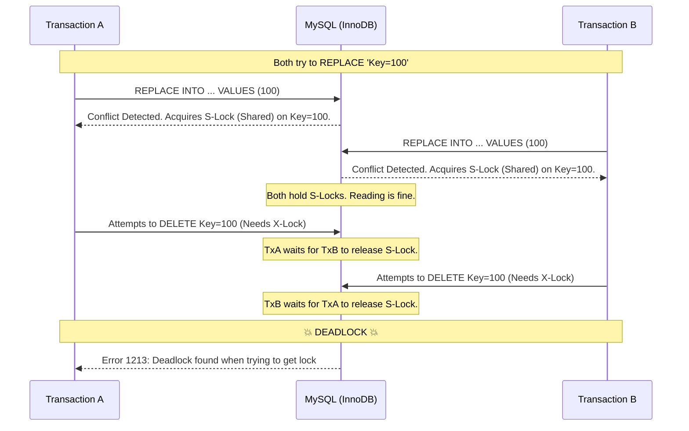
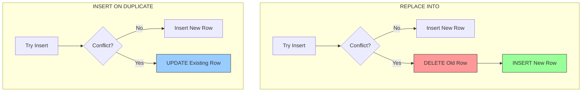

In distributed systems, **Upsert** (Update or Insert) is a fundamental operation. You want to store a record: if it exists, update it; if not, create it.

MySQL offers a deceptively simple command to handle this: `REPLACE INTO`. It looks like a standard insert, works like a charm in development, and satisfies the requirement of "single statement atomicity."

However, under high concurrency, `REPLACE INTO` can become a source of **deadlocks**, **latency spikes**, and **unexpected behavior**.

In this post, we will tear apart the `REPLACE` statement to understand its internal mechanics, how InnoDB handles locking, and why your client application **must** be prepared to handle concurrency explicitly.

## 1. The "Atomic" Myth

Developers often assume that because `REPLACE INTO` is a single SQL statement, it is a single atomic operation that effectively "locks" the row, does the job, and leaves.

**The Reality:**
Internally, `REPLACE INTO` is **not** a simple update. It is a destructive two-step process disguised as one.

:::danger How REPLACE works internally
1.  **Check:** It attempts to insert the new row.
2.  **Conflict:** If a Unique Key or Primary Key collision occurs:
    * **Step A:** It performs a **DELETE** of the conflicting row.
    * **Step B:** It performs a fresh **INSERT** of the new row.
      :::

This "Delete + Insert" behavior has massive implications for locking and referential integrity.

---

## 2. The Locking Mechanism: Why Deadlocks Happen

To understand why concurrent `REPLACE` operations cause deadlocks, we need to look at **InnoDB Locking**.

### The Gap Lock & Next-Key Lock
When you write to a table with a Unique Index, MySQL must ensure that no other transaction inserts a duplicate value while your transaction is running.

1.  **Shared Lock (S-Lock):** When `REPLACE` detects a duplicate, it first acquires a *Shared Lock* on the existing record to ensure it stays there while it decides what to do.
2.  **Exclusive Lock (X-Lock):** To delete the old row and insert the new one, it must upgrade that lock to an *Exclusive Lock*.

### The Deadlock Scenario

Imagine two clients (Transaction A and Transaction B) trying to `REPLACE` the **same key** at the exact same time.



:::warning The Deadlock Trap
1.  **TxA** holds **S-Lock**. Wants **X-Lock**. Waits for **TxB**.
2.  **TxB** holds **S-Lock**. Wants **X-Lock**. Waits for **TxA**.
3.  InnoDB detects the cycle and kills one transaction (usually the smaller one) to break the deadlock.
    :::

**Does MySQL inherently handle it?**
Technically, yes—by **killing** one of your requests. MySQL resolves the deadlock by forcing an error on one client. It does **not** queue them up nicely; it breaks the logjam with force.

**Does the client need to handle it?**
**YES.** Your code **must** catch Error `1213` and implement a retry logic.

---

## 3. REPLACE vs. INSERT ON DUPLICATE KEY UPDATE

If `REPLACE` is so dangerous, what should we use?
The industry standard alternative is `INSERT ... ON DUPLICATE KEY UPDATE` (IODKU).

Let's compare the internal semantics.

| Feature | `REPLACE INTO` | `INSERT ON DUPLICATE ...` |
| :--- | :--- | :--- |
| **Mechanic** | Delete + Insert | Update |
| **Primary Key** | **Changes** (New ID generated) | **Preserved** (ID stays same) |
| **Foreign Keys** | **Breaks** (Cascading Deletes triggered) | **Safe** (References maintained) |
| **Locking** | Aggressive (Gap/Next-Key Locks) | Moderate (Row Locks) |
| **Deadlocks** | High Probability | Lower Probability (but non-zero) |

### Visualizing the Mechanics



:::tip Pro Tip: Why IODKU is usually better
`INSERT ON DUPLICATE KEY UPDATE` is non-destructive.
1.  It performs a "logical" update.
2.  It does not churn your auto-increment IDs. `REPLACE` creates "holes" in your ID sequence because every update burns an ID.
3.  It avoids `DELETE` triggers firing unexpectedly.
    :::

---

## 4. Does MySQL inherently handle concurrent upserts?

MySQL handles **Data Integrity** (ACID) perfectly. It will never let two transactions corrupt the data. However, it handles concurrency by using **Locks**. When locks conflict cyclically, it handles it via **Deadlock Detection** (rolling back one transaction).

It does **not** inherently "serialize" them without side effects. The side effect is the Deadlock Error.

### What are the internal semantics?
1.  **Gap Locks:** Even with `READ COMMITTED` isolation, unique constraint checks trigger Gap Locks or Next-Key Locks. This locks the "space" before and after the record.
2.  **Lock Upgrades:** The transition from Shared (Read) to Exclusive (Write) is the danger zone.

---

## 5. Implementation Strategy

If you are building a high-scale system, you should prefer `INSERT ON DUPLICATE KEY UPDATE`. However, regardless of which statement you choose, you must implement a retry loop in your application code.

### Python Pseudo-code for Robust Upsert

```python
MAX_RETRIES = 3

def upsert_data(key, value):
    retries = 0
    while retries < MAX_RETRIES:
        try:
            # Prefer IODKU over REPLACE
            cursor.execute("""
                INSERT INTO store (`key`, `value`, `updated_at`) 
                VALUES (%s, %s, NOW())
                ON DUPLICATE KEY UPDATE 
                `value` = VALUES(`value`), 
                `updated_at` = NOW()
            """, (key, value))
            
            db.commit()
            return # Success!
            
        except MySQLdb.OperationalError as e:
            if e.args[0] == 1213: # Error Code: Deadlock found
                retries += 1
                time.sleep(0.1 * retries) # Exponential Backoff
                continue
            else:
                raise e # Real error, re-raise
```

:::note Key Takeaway
At scale, **Database Deadlocks are not bugs; they are a fact of life.** They are the database's way of protecting your data's consistency. Your application logic must be resilient enough to retry when they happen.
:::