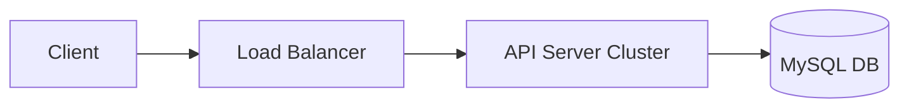
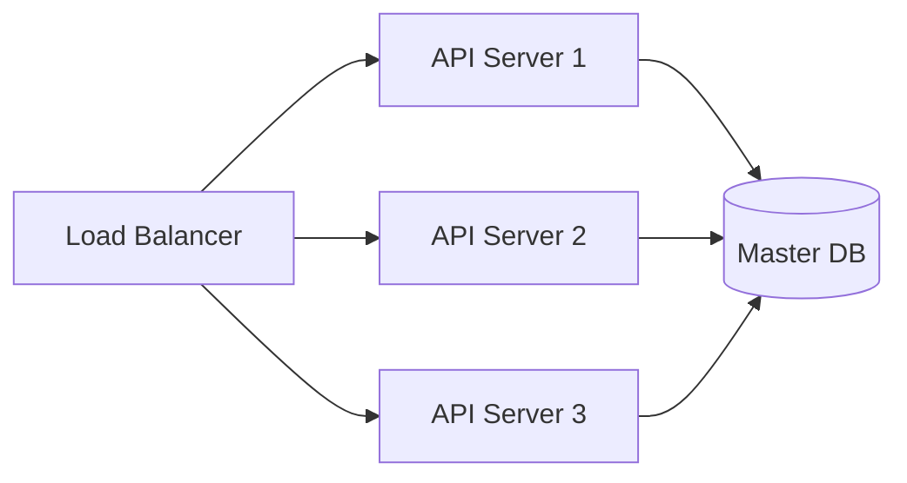
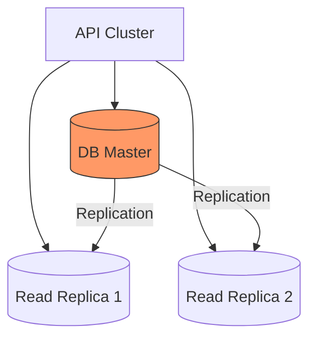
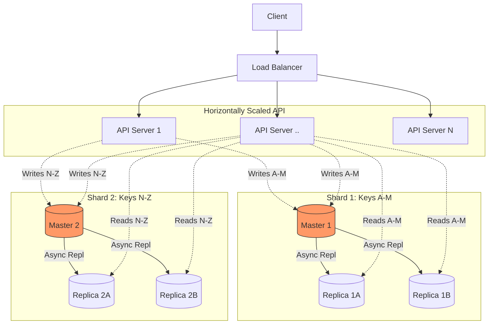

In this post, we will walk through the journey of designing and implementing a horizontally scalable Key-Value store. We will start from a basic implementation, iterate through schema designs, optimize for performance, and finally scale it to handle massive loads.

### Requirements
1.  **Horizontally Scalable:** The system must handle growth in data and traffic.
2.  **Core Operations:** Support `GET`, `PUT`, `DEL`, and `TTL` (Time To Live).

---

## 1. The Initial Architecture

To begin, let's look at a typical 3-tier application architecture. This serves as our baseline.



:::tip Concept: Storage and Compute Separation
One of the most powerful architectural patterns in modern cloud computing is the **Separation of Storage and Compute**.

* **Independent Scaling:** You can scale your processing power (API/Compute) independently from your data storage size. If your logic becomes complex but data volume is low, you scale compute. If you store petabytes but access it rarely, you scale storage.
* **Cost Optimization:** This significantly reduces TCO (Total Cost of Ownership). You don't pay for CPU cycles you don't use just because you need more disk space.
* **Cloud Native Examples:**
    * **Snowflake:** Pioneered this by allowing data to sit in S3 (cheap object storage) while spinning up "Warehouses" (Compute) only when queries run.
    * **AWS Aurora:** The compute node processes queries, but the storage is a distributed, self-healing volume that grows automatically.
    * **AWS DocumentDB:** This is a classic example. Clients see a MongoDB-compatible API (NoSQL), but it is actually built on top of the Aurora storage engine (Relational/Cloud Native). **Clients care about guarantees and APIs, not the underlying engine.**
      :::

For this blog, we will use **MySQL** as our persistence layer.

---

## 2. Schema Design: The Performance Trap

We need to store a Key, a Value, and manage the lifecycle (TTL) of the data. Let's evaluate two schema options.

### Option 1: Calculated Expiry
```sql
CREATE TABLE store (
    `key` VARCHAR(255) PRIMARY KEY,
    `value` TEXT,
    `created_at` DATETIME,
    `ttl` INT
);
```
To delete expired items, the query would be:
`DELETE FROM store WHERE created_at + ttl < NOW();`

### Option 2: Pre-calculated Expiry
```sql
CREATE TABLE store (
    `key` VARCHAR(255) PRIMARY KEY,
    `value` TEXT,
    `expired_at` BIGINT,
    INDEX idx_expiry (expired_at)
);
```

### Why Option 1 is a disaster for scale

In Option 1, the condition `WHERE created_at + ttl < NOW()` creates a massive performance bottleneck.

When you perform an operation on a column (like addition) on the left side of a comparison, the database **cannot** efficiently use a B-Tree index. The database engine must perform the calculation `created_at + ttl` for **every single row** in the table to determine if it meets the criteria.

This results in a **Full Table Scan** (or a full index scan), which operates at `O(N)` complexity. If you have 100 million rows, the DB reads 100 million rows.

### Why Option 2 wins
In Option 2, we store `expired_at`. This is a static value.
1.  **Sorted Storage:** The Secondary Index on `expired_at` keeps pointers sorted by time.
2.  **Efficient Range Scan:** The query becomes `WHERE expired_at < NOW()`. The database goes to the index, finds the first entry, and reads sequentially until it hits the timestamp for `NOW()`. This is an efficient range seek.

**Decision:** We will proceed with **Option 2**.

---

## 3. Implementing Operations

Now let's implement the core logic, keeping network efficiency and database load in mind.

### The INSERT / PUT Operation

A naive implementation might look like this:

```python
def put(key, value, ttl):
    start_transaction()     # 1. Network Call
    v = get(key)            # 2. Network Call
    if v:
        update(key, value)  # 3. Network Call
    else:
        insert(key, value)  # 3. Network Call
    commit()                # 4. Network Call
```

**The Problem:** This requires up to 4 distinct network round trips to the database for a single application request. At scale, this latency kills performance.

**The Solution:** Use an **UPSERT**. In MySQL, we can use `REPLACE INTO` or `INSERT ON DUPLICATE KEY UPDATE`.

```sql
REPLACE INTO store (`key`, `value`, `expired_at`) 
VALUES ('my_key', 'my_value', 1735460000);
```

:::info Transaction Autocommit
In modern databases (like MySQL with InnoDB), if you fire a single statement like `REPLACE INTO` or `UPDATE`, the engine implicitly starts a transaction, executes the statement, and commits it. You do not need to manually handle transaction boundaries for single atomic operations.
:::

We have optimized 4 operations down to **1**.

### The GET Operation

We must ensure we don't return expired data, even if the cleanup job hasn't run yet.

```sql
SELECT value 
FROM store 
WHERE key = 'my_key' AND expired_at > NOW();
```

### The DEL Operation

:::note Concept: Hard vs. Soft Deletes
* **Hard Delete:** Physically removes the row from the storage. This causes immediate I/O overhead as the B-Tree must rebalance and pages might need to be merged.
* **Soft Delete:** Updates a flag (e.g., `is_deleted=true`) or a timestamp. The data remains but is logically invisible. This minimizes immediate I/O fluctuation.
  :::

To implement `DEL` efficiently, we will perform a **Soft Delete** by expiring the key immediately. We update the `expired_at` to a past timestamp (or a sentinel value like -1) to indicate it was deleted by the user, not naturally expired.
*More details on hard deletes can be found [here](/avoid-hard-deletes.md).*
```sql
UPDATE store 
SET expired_at = -1 
WHERE key = 'my_key' AND expired_at > NOW();
```

---

## 4. The TTL Cleanup (Garbage Collection)

We need a background cron job to physically remove expired rows.

**Naive Approach:**
```sql
DELETE FROM store WHERE expired_at < NOW();
```

:::warning Performance Risk: Unbounded Deletes
**Never perform unbounded deletes in production.**
If your table has 100 million rows and 10 million are expired:
1.  The DB tries to lock all 10 million rows.
2.  It fills up the Undo/Redo logs to support rollback.
3.  It spikes CPU and IO, potentially blocking live traffic.
    **Bounded Deletes are always superior.** Deleting 100 rows in a loop is infinitely better than crashing the DB trying to delete 10k at once.
    :::

**Optimized Approach (Batching):**

```sql
DELETE FROM store 
WHERE expired_at < UNIX_TIMESTAMP() 
LIMIT 1000;
```
The cron job should run this query in a loop until the affected row count is 0.

---

## 5. Scaling the System

We have the logic. Now, let's handle the growth.

### Scenario 1: High Traffic (Read/Write)
If the number of requests spikes, the first bottleneck is usually the CPU/Memory on the API servers.

**Solution:** Horizontally scale the API layer.

:::tip Recap: Storage/Compute Separation
Because our API (Compute) is decoupled from the DB (Storage), we can spin up 50 new API instances without touching the Database configuration.
:::



### Scenario 2: Read Heavy Load
As you grow, the single Master DB will struggle to handle all the `SELECT` queries.

**Solution:** Add Read Replicas.



We route `PUT/DEL` to Master, and `GET` to Replicas.

:::danger The Cost of Scale: Eventual Consistency
When you introduce Read Replicas, you introduce **Replication Lag**.
1.  Client A writes `Key=X` to Master.
2.  Client B reads `Key=X` from Replica 1 immediately.
3.  If the data hasn't copied over yet (lag), Client B gets a **Cache Miss** or stale data.

**Real World Solution: DynamoDB**
Amazon DynamoDB solves this by giving the client a choice. You can perform a standard read (eventually consistent, cheaper) or a **Strongly Consistent Read**.
If you request `ConsistentRead=True`, DynamoDB routes the request to the Leader node to guarantee the latest data, but it consumes 2x capacity units (costs more).
:::

### Scenario 3: Write Heavy Load
Eventually, your Master DB won't handle the incoming write volume.

**Step 1: Vertical Scaling.** Upgrade the Master to a bigger machine (more RAM, better CPU).
**Step 2: Sharding.** When vertical scaling hits the limit (physics or cost), we shard.

More details on sharding can be found in my previous [post on sharding](/scaling.md#3-sharding).

## Final Architecture

Here is the final system diagram, fully scaled vertically and horizontally, featuring sharded masters and read replicas.

