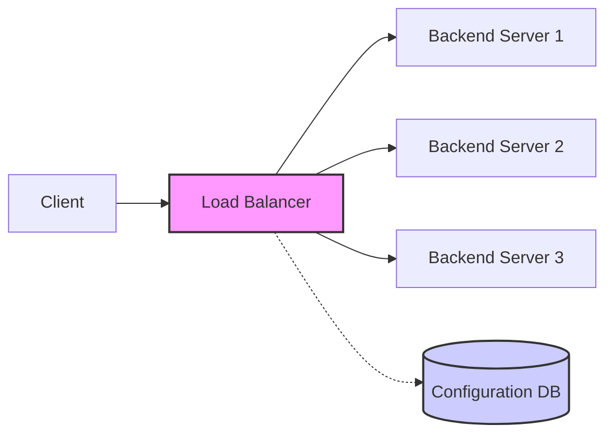
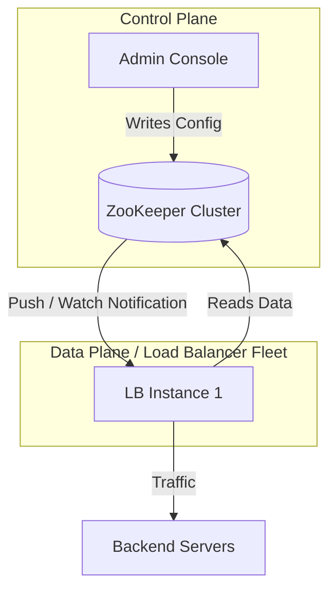
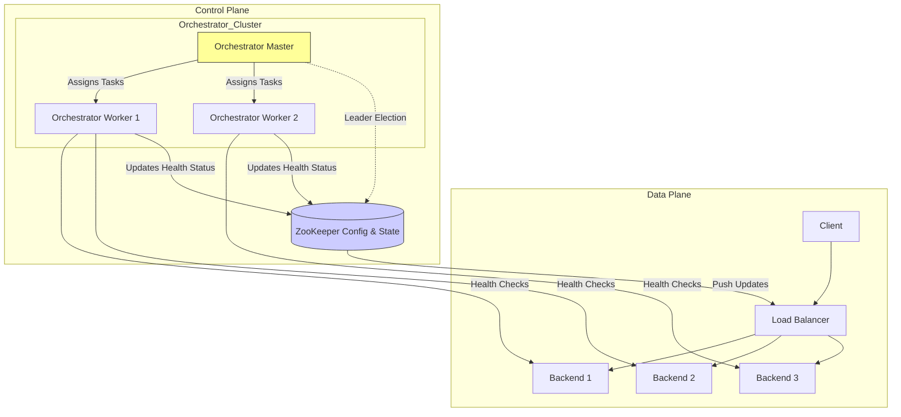
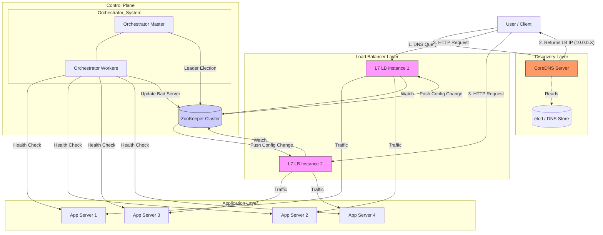

In this series, we will evolve the design of a Layer 7 Load Balancer (LB) from scratch. We won't just look at *how* to build it, but *why* we make specific architectural choices at every fork in the road.

## 1) Define the Requirements

Before writing code, we must define the "must-haves" of our system.

* **Load the Balance:** The core responsibility is distributing incoming network traffic across multiple backend servers to ensure no single server becomes a bottleneck. This maximizes throughput and minimizes response time.
* **Tunable Algorithm:** We cannot rely on a single distribution strategy. Different workloads require different approaches (e.g., Round Robin for uniform services, Weighted Round Robin for heterogenous capacity, or Least Connections for long-lived sessions).
* **Scaling beyond single Load Balancer:** The LB itself shouldn't become the single point of failure (SPOF) or the bottleneck. We must design for horizontal scalability where we can add more LB nodes dynamically as traffic increases.

## 2) Need of Persistence for the LB Configurations

Why do we need a database for a load balancer? Can't we just hardcode the backend IPs in a config file?

In a modern distributed system, the environment is dynamic. Backend servers auto-scale (scale-out/in), health checks fail, and routing rules change. If we hardcode configurations, every change requires a redeployment of the Load Balancer fleet. This is unacceptable.

We need to decouple the **Control Plane** (Configuration Management) from the **Data Plane** (Traffic Forwarding). Administrators should be able to tune parameters (add backends, change algorithms, update health check paths) via a console, and these changes must persist in a reliable store that the LB instances can read from.

**Architecture V1:**



### 2.a) Need of cache for the LB configurations

While the architecture above works functionally, it fails non-functionally. If the Load Balancer hits the Configuration DB for **every single request**, we introduce massive latency.

* **Load Balancer Overheads:** The time spent by the LB processing the request before forwarding it.
* **The Latency Cost:** If a network round-trip to the DB takes 5ms, we are adding 5ms to *every* user request. In high-throughput systems (100k+ RPS), this also creates a "Thundering Herd" problem that will crush the database.

**Constraint:** LB overhead must be extremely minimal (sub-millisecond).

To solve this, we introduce an **In-Memory Cache** within the Load Balancer. The LB reads from its local RAM, which is nanosecond-latency fast.

**The Data Model (Key-Value):**
We need a simple Key-Value store structure where the key is the LB Group Name and the value is the configuration blob.

```json
"lb-group-1" : {
    "backend_servers" : ["10.0.0.1:80", "10.0.0.2:80"], 
    "health_endpoint" : "/health", 
    "health_endpoint_expected_code": 200,
    "health_check_frequency_seconds" : 10,
    "algorithm" : "WEIGHTED_ROUND_ROBIN"
}
```

However, caching introduces a classic distributed system problem: **Cache Staleness**.

### 2.b) How to keep the cache in sync with the Configurations DB

If an admin adds a new backend server to the DB, the LB's in-memory cache still holds the old list. We need a sync mechanism.

#### Option 1: The PULL Approach (Polling)
We run a background cron job on the LB every 10 seconds to fetch the latest config from the DB.
* **The Problem:** There is a "Staleness Window" of up to 10 seconds. If a backend server is removed from the DB because it was corrupted, the LB might still send traffic to it for 10 seconds, causing 5xx errors for users.
* **Verdict:** Acceptable for low-criticality systems, but "bad product experience" for high-availability requirements.

#### Option 2: The PUSH Based Approach
In this model, whenever the Configuration DB is updated, it actively "pushes" a notification to all Load Balancers to invalidate or update their cache immediately.
* **The Advantage:** This minimizes the staleness window to mere milliseconds. The system reacts in near real-time.
* **Verdict:** Preferred for production-grade Load Balancers.

### 2.c) Choice of Configuration DB

We need a technology that offers **Persistence** (durability) + **Key-Value Lookup** + **Push/Watch Capabilities**.

Let's evaluate the options:

1.  **Kafka:**
    * *Analysis:* Kafka is an event streaming platform, not a configuration store. It is fundamentally PULL-based (consumers poll for messages). Using it as a source of truth for current state is an anti-pattern (requires log compaction gymnastics).
    * *Verdict:* **Reject.**

2.  **DynamoDB + DynamoDB Streams:**
    * *Analysis:* Excellent for persistence and HA. However, DynamoDB Streams require a Lambda or consumer to poll the stream and then fan-out updates. It doesn't provide a native "direct-to-client" push channel.
    * *Verdict:* **Reject** (Too much glue code required).

3.  **Redis Pub/Sub:**
    * *Analysis:* Redis is a fantastic KV store. Pub/Sub allows the "Control Plane" to publish an update to a channel that all LBs subscribe to.
    * *The Risk:* Redis Pub/Sub operates on "At-Most-Once" delivery. If an LB node restarts or has a network blip during the publish event, it **misses the message forever**. It has no persistence for the channel messages.
    * *High Availability:* Redis Sentinel can provide HA, but it is historically tricky to configure correctly to avoid split-brain scenarios. Relying on it for the "source of truth" configuration can be risky without a backup polling mechanism.
    * *Verdict:* **Good**, but requires a "safety net" (occasional polling).

4.  **ZooKeeper (The Winner):**
    * *Analysis:* ZooKeeper is explicitly designed for distributed coordination and configuration management.
    * *ZNodes:* It stores data in file-system-like paths (Key-Value style).
    * *Watches (The Push Mechanism):* Clients can place a "Watch" on a ZNode. When the data changes, ZooKeeper sends a notification to the client. This is a robust Push mechanism.
    * *Consistency:* It uses the ZAB (ZooKeeper Atomic Broadcast) protocol, guaranteeing strong consistency.
    * *High Availability:* Running a ZK Ensemble (3 or 5 nodes) tolerates node failures without data loss.
    * *Verdict:* **Excellent Fit.** It solves Persistence + Push + HA natively.

### Final Architecture for Persistence Layer

We will use **ZooKeeper** as our configuration source of truth.

1.  **Control Plane** writes config to ZooKeeper ZNode (`/lb-configs/lb-1`).
2.  **Load Balancers** keep a "Watch" on that ZNode.
3.  **Event:** When config changes, ZK notifies all LBs.
4.  **Action:** LBs fetch the new data, update their local In-Memory Cache, and re-set the Watch.



## 3) Need of Orchestrator layer to monitor the health of backend servers

A Load Balancer is only as good as the servers it points to. If a backend server crashes, gets overloaded, or becomes unresponsive, the Load Balancer must stop sending traffic to it immediately. Without this "circuit breaking" capability, a single failing server can cause a cascade of errors for the end users (502 Bad Gateway), turning a partial outage into a total system failure. The LB needs an intelligent subsystem to actively verify that its destinations are actually capable of handling work.

**Enter the Orchestrator.**

The Orchestrator acts as the "Health Monitor" of our system. It operates in a continuous loop:
1.  **Fetch Configuration:** It continually watches the Configuration DB (ZooKeeper) to know which backend servers are supposed to be active and what their health check parameters are (e.g., endpoint `/health`, interval `10s`).
2.  **Probe:** It actively sends HTTP requests (or TCP pings) to these endpoints on the backend servers.
3.  **Decide & Update:** If a server fails to respond with a `200 OK` for a configured threshold (e.g., 3 consecutive failures), the Orchestrator marks it as "Unhealthy." It then updates the Configuration DB (ZooKeeper), effectively removing that server from the active rotation. Since our LBs are watching ZooKeeper, they immediately stop routing traffic to the dead node.

### 3.a) Making the Orchestrator layer Highly Available

We cannot rely on a single Orchestrator node. If that single node dies, health checks stop. If health checks stop, the Load Balancers are flying blind—they might route traffic to dead servers (false negatives) or fail to route to recovered servers (false positives).

To solve this, we implement a **Master-Worker Architecture with Leader Election**:

* **Master Node:** Responsible for coordination. It divides the list of backend servers into chunks and assigns them to different Worker nodes to balance the health-checking load.
* **Worker Nodes:** These are the workhorses. They perform the actual HTTP pings to the backend servers and report status back to the Master or directly to the DB.
* **Self-Healing & Leader Election:** We leverage **ZooKeeper's Ephemeral Nodes** for this. All Orchestrator nodes attempt to create a lock file (ZNode) in ZooKeeper.
    * The node that succeeds becomes the **Master**.
    * The others become **Workers** (standby).
    * If the Master process dies, its ephemeral node in ZooKeeper disappears. The Worker nodes detect this event immediately and trigger a new election. One of them promotes itself to Master, ensuring zero downtime for the monitoring subsystem.

**System State Diagram (So Far):**



---

## 4) Understanding Scalability of the Load Balancer Itself

We have scaled the backends, but what happens when the Load Balancer *itself* is overwhelmed?

A single LB instance has limits—CPU, Memory, and Network Bandwidth (throughput). To detect this, we inject metrics (active connections, request latency, CPU usage) into a Time-Series Database (like Prometheus or InfluxDB). When thresholds are breached, our Auto-Scaling Group triggers the provision of a new Load Balancer instance.

**The Discovery Problem:**
If we add a new Load Balancer (IP: `10.0.0.50`) to help the existing one (IP: `10.0.0.10`), how do clients know? Clients typically have the domain `api.myblog.com` cached to point to `10.0.0.10`. We cannot put another Load Balancer in front of our Load Balancers, or we just move the bottleneck one layer up (turtles all the way down).

### Routing Requests amongst different LB servers via CoreDNS

We solve this using **DNS Load Balancing** with **CoreDNS**.

CoreDNS is a flexible, extensible DNS server that can serve as the entry point for our traffic. Instead of a static mapping, CoreDNS can dynamically return different IP addresses for the same domain name.

#### 1. Round Robin & Weighted Load Balancing
CoreDNS can be configured to return multiple A records (IP addresses) for a single domain. Modern clients (browsers, mobile apps) will try these IPs. We can update these records dynamically as we scale our LB fleet.

#### 2. Geolocation & Latency Routing
CoreDNS can utilize plugins (like the `geoip` plugin) to inspect the source IP of the incoming DNS query.
* **User from India** -> CoreDNS resolves `blog.com` to the VIP (Virtual IP) of the LB cluster in Mumbai.
* **User from US** -> CoreDNS resolves `blog.com` to the VIP of the LB cluster in Virginia.

**Technical Implementation:**
CoreDNS often uses an `etcd` backend to store records, allowing for real-time updates without restarting the DNS server. Here is how a **JSON** record for an LB service might look inside the store that CoreDNS reads:

**The CoreDNS Configuration (Corefile):**
```
. {
    etcd myblog.com {
        path /skydns
        endpoint http://etcd-cluster:2379
    }
    loadbalance round_robin
    cache 30
}
```

**The Data (stored in etcd as JSON):**
This is the "Service Discovery" record. The key path represents the domain, and the value is the target LB.

```json
/* Key: /skydns/com/myblog/api/lb1 */
{
    "host": "10.0.0.10",
    "port": 80,
    "priority": 10,
    "weight": 100,
    "text": "Location: US-East"
}

/* Key: /skydns/com/myblog/api/lb2 */
{
    "host": "10.0.0.50",
    "port": 80,
    "priority": 10,
    "weight": 100,
    "text": "Location: US-East"
}
```
*Note: By adjusting the `weight` or removing the entry, we control traffic flow to the LBs instantly.*

---


## 5) Making the Discovery Layer Highly Available

We have introduced CoreDNS to handle the discovery of our Load Balancers. But we have introduced a new problem: **What if the CoreDNS server itself goes down?**

If our DNS layer fails, new clients cannot resolve the domain name to an IP address. Even if our Load Balancers and Backend Servers are healthy, the door to our system is effectively locked.

To solve this, we cannot simply spin up two CoreDNS servers with different IP addresses and hope for the best. Clients typically configure a specific IP (or a limited list) for their DNS resolver. We need a way to have multiple DNS servers "share" a single, highly available IP address.

**Enter Keepalived and the Virtual IP (VIP).**

### The Concept: Virtual IP (VIP)

In standard networking, two machines cannot share the same IP address on the same network segment. If they do, it causes an IP conflict, and switches/routers get confused about where to send packets.

A **Virtual IP (VIP)** is a "floating" IP address that is not permanently bound to a specific physical machine's network interface. Instead, it is a resource that can be dynamically claimed by a machine.
1.  We assign a VIP (e.g., `192.168.1.100`) to our DNS cluster.
2.  Clients are configured to send DNS queries to `192.168.1.100`.
3.  Only the **Master** node currently "holds" this IP.
4.  If the Master dies, a **Backup** node detects the failure and immediately "claims" the IP, handling traffic seamlessly.

### The Solution: Keepalived

We use **Keepalived**, a routing software that implements the **VRRP (Virtual Router Redundancy Protocol)**.

#### How VRRP Works
VRRP is designed to eliminate single points of failure.
* The nodes in the cluster communicate using **Multicast** packets.
* The **Master** node periodically sends "advertisements" (heartbeats) to the multicast group.
* The **Backup** nodes listen for these advertisements.
* If the Backup nodes stop receiving advertisements (meaning the Master is dead or network partitioned), the Backup with the highest priority promotes itself to Master and claims the VIP.

#### The Configuration: `keepalived.conf`

Let's look at the implementation. We install Keepalived on both CoreDNS servers.

**Master Node Configuration (`/etc/keepalived/keepalived.conf`):**

```bash
vrrp_instance VI_1 {
    state MASTER           # 1. Initial State
    interface eth0         # 2. Network Interface to bind to
    virtual_router_id 51   # 3. Unique ID for this cluster
    priority 100           # 4. Election Priority (Higher wins)
    advert_int 1           # 5. Advertisement Interval (1 second)
    
    authentication {
        auth_type PASS
        auth_pass my_secret_password
    }

    virtual_ipaddress {
        192.168.1.100/24   # 6. The Virtual IP (VIP)
    }
}
```

**Backup Node Configuration:**

```bash
vrrp_instance VI_1 {
    state BACKUP           # Starts as backup
    interface eth0
    virtual_router_id 51   # Must match the Master
    priority 90            # Lower priority than Master
    advert_int 1
    
    authentication {
        auth_type PASS
        auth_pass my_secret_password
    }

    virtual_ipaddress {
        192.168.1.100/24   # Must match the Master
    }
}
```
We have now eliminated the final Single Point of Failure in our control path.

## Final Architecture: The Complete Picture

We have now evolved a robust, scalable, and self-healing L7 Load Balancer system.

1.  **Clients** query **CoreDNS** to find an available Load Balancer.
2.  **CoreDNS** returns the IP of a healthy LB (based on Geo/Load).
3.  **L7 Load Balancers** receive traffic. They read their routing rules and backend lists from **ZooKeeper** (cached in memory).
4.  **Backend Servers** process the requests.
5.  **Orchestrator Cluster** (Master/Worker) continuously probes Backends and updates **ZooKeeper** if health status changes.
6.  **ZooKeeper** pushes config updates to LBs in real-time.

