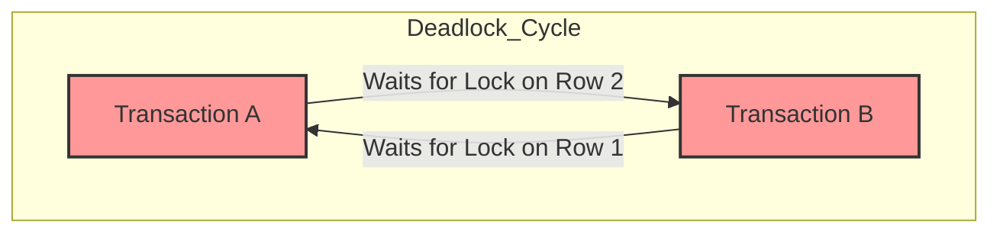
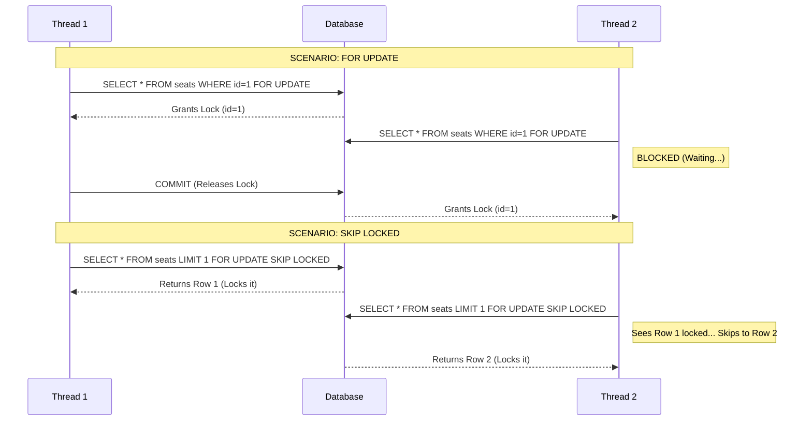
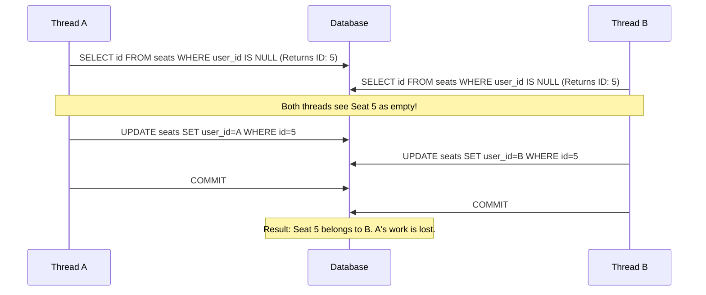
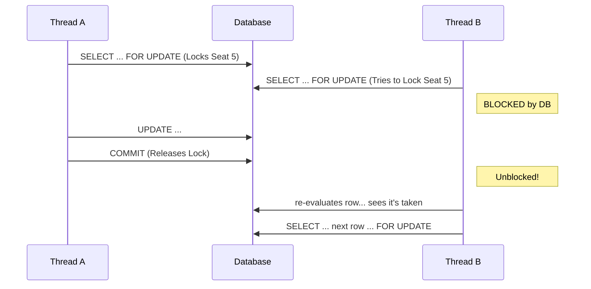
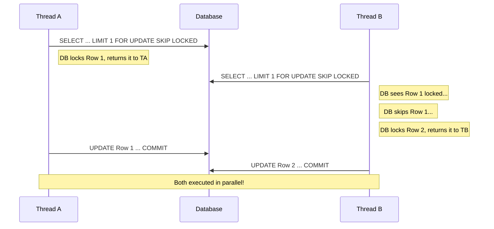

In distributed systems, managing access to shared resources is one of the most critical challenges we face. When multiple processes or threads attempt to modify the same data simultaneously, we risk race conditions that can corrupt the system's state.

This post explores **Pessimistic Locking**—a mechanism where we assume a conflict will occur and lock the data before operating on it. We will dive into MySQL's locking mechanisms, deadlock detection, and analyze a Python simulation to see these locks in action.

## 1. What are Locks and Why Do We Need Them?

At its core, a database is the "Source of Truth" for an application. If this source becomes corrupted, the entire integrity of the system collapses.

In a concurrent environment (like a web server handling thousands of requests), multiple transactions often try to access and modify the same database row at the exact same millisecond. Without protection, we encounter the **Lost Update Problem**:

1.  Transaction A reads a value (e.g., `seats_available = 1`).
2.  Transaction B reads the same value (`seats_available = 1`).
3.  Transaction A updates the value to 0.
4.  Transaction B *also* updates the value to 0.

Both transactions believe they successfully reserved the last seat, but the database is now in an inconsistent state.

**Pessimistic Locking** solves this by preventing other transactions from modifying (and often reading) the data until the lock holder is finished. It enforces a strict "I was here first" policy, ensuring that the shared resource is mutually exclusive during the critical section of the update.

## 2. The Downside: Deadlocks

While locks protect data, they introduce a new danger: **Deadlocks**.

A deadlock occurs when two or more transactions are waiting for one another to give up locks, resulting in a cycle where no one can proceed.

### Deadlock Detection in MySQL (InnoDB)

Modern storage engines have sophisticated deadlock detection mechanisms. They maintain a **Wait-For Graph** (a directed graph) where nodes are transactions and edges represent one transaction waiting for a lock held by another.

* If the graph contains a **cycle**, a deadlock exists.
* DB immediately detects this cycle.
* It resolves the deadlock by kills one of the transactions (usually the one that has done the least amount of work) to allow the other to proceed.

**The Error:**
When MySQL kills a transaction to break a deadlock, it throws the following error:
> `ERROR 1213 (40001): Deadlock found when trying to get lock; try restarting transaction`

### Visualizing the Deadlock Graph



## 3. Acquiring Locks in MySQL

MySQL provides specific syntax to interact with row-level locking during a `SELECT` statement.

### `FOR UPDATE`
This is the standard pessimistic lock. It tells the database: *"I intend to update these rows. Lock them exclusively. If anyone else has them locked, I will wait until they are released."*

* **Behavior:** Blocks if the row is already locked.
* **Use Case:** Strict consistency where processing order matters or where you must update specific rows.

### `NOWAIT`
This tells the database: *"I want to lock these rows. If they are already locked, do not make me wait. Fail immediately."*

* **Behavior:** Throws an error immediately if the row is locked.
* **Use Case:** Real-time systems where failing fast is better than queuing.

### `SKIP LOCKED`
This is a powerful feature for high-concurrency queues. It tells the database: *"I want to lock rows that match my criteria. If some are already locked by others, just skip them and give me the next available ones."*

* **Behavior:** Does not wait; simply ignores locked rows and returns the free ones.
* **Use Case:** Ticket booking, job queues, task distribution.

#### Locking Visualization



## 4. Code Walkthrough & Scenario Analysis

I created a Python script to simulate a high-concurrency seat reservation system. The script spawns multiple threads, where each thread attempts to:
1.  Start a transaction.
2.  Find an available seat (`user_id IS NULL`).
3.  Book it (`UPDATE seats SET user_id...`).
4.  Commit.

Let's analyze the behavior under three different locking strategies.

### Scenario 1: WITHOUT "FOR UPDATE"

**Observation:** The number of reserved seats is **highly non-deterministic** and almost always less than the number of threads.

**Why? (The Race Condition)**
This is a classic "Check-Then-Act" race condition.
1.  **Thread Scheduling:** The OS schedules Thread A and Thread B to run almost simultaneously on different CPU cores.
2.  **Snapshot Isolation:** Thread A runs `SELECT` and sees Seat #1 is empty. Before Thread A can run the `UPDATE` statement, the OS context switches or simply executes Thread B in parallel.
3.  **Duplicate Reads:** Thread B runs the same `SELECT` and *also* sees Seat #1 is empty (because A hasn't committed yet).
4.  **The Overwrite:** Thread A updates Seat #1 and commits. Thread B updates Seat #1 (overwriting A's work) and commits.
5.  **Result:** Two threads think they booked a seat, but only one record exists in the DB. One reservation is effectively "lost."


```info
2025-12-26 17:38:55,400 - MainThread - INFO - SEAT RESERVATION SYSTEM - COMPLETED
2025-12-26 17:38:55,400 - MainThread - INFO - ================================================================================
2025-12-26 17:38:55,400 - MainThread - INFO - Threads requested: 32
2025-12-26 17:38:55,400 - MainThread - INFO - Seats created: 32
2025-12-26 17:38:55,400 - MainThread - INFO - Seats reserved: 4
2025-12-26 17:38:55,400 - MainThread - INFO - Execution time: 7 ms
2025-12-26 17:38:55,400 - MainThread - INFO - ================================================================================
```

### Scenario 2: WITH "FOR UPDATE"

**Observation:** The number of reserved seats **always equals** the total number of seats (up to the thread limit). Consistency is maintained.

**Why? (Blocking & Re-evaluation)**
When Thread A runs `SELECT ... FOR UPDATE`, the database locks that specific row (Seat #1).

1.  **The Block:** If Thread B tries to select Seat #1, the DB forces it to **wait**.
2.  **The Re-evaluation:** Once Thread A commits, it releases the lock. Thread B wakes up.
3.  **The Loop/Retry:** When Thread B acquires the lock, it sees the *latest* committed data. It realizes Seat #1 is now taken (user_id is NOT NULL), so it must restart the search or move to the next available row.

This serialization ensures that no two threads can ever "win" the same seat.


```info
2025-12-26 17:43:25,625 - MainThread - INFO - SEAT RESERVATION SYSTEM - COMPLETED
2025-12-26 17:43:25,625 - MainThread - INFO - ================================================================================
2025-12-26 17:43:25,625 - MainThread - INFO - Threads requested: 32
2025-12-26 17:43:25,625 - MainThread - INFO - Seats created: 32
2025-12-26 17:43:25,625 - MainThread - INFO - Seats reserved: 32
2025-12-26 17:43:25,625 - MainThread - INFO - Execution time: 25 ms
2025-12-26 17:43:25,625 - MainThread - INFO - ================================================================================
```

### Scenario 3: WITH "FOR UPDATE SKIP LOCKED"

**Observation:** The number of seats reserved is correct (consistent), but the **total execution time is significantly lower** than Scenario 2.

**Why? (Concurrency without Contention)**
This is the gold standard for job queues or booking systems.

1.  **No Waiting:** Thread A grabs Seat #1. Thread B comes in, sees Seat #1 is locked, and *instantly* skips it to grab Seat #2.
2.  **Parallelism:** Because threads don't wait for each other, they can utilize the full connection pool simultaneously.
3.  **Result:** If you have 10 threads, you reserve 10 seats in roughly the time it takes to reserve 1 seat, rather than the time it takes to reserve 10 seats sequentially.

```info
2025-12-26 17:47:55,625 - MainThread - INFO - SEAT RESERVATION SYSTEM - COMPLETED
2025-12-26 17:47:55,625 - MainThread - INFO - ================================================================================
2025-12-26 17:47:55,625 - MainThread - INFO - Threads requested: 32
2025-12-26 17:47:55,625 - MainThread - INFO - Seats created: 32
2025-12-26 17:47:55,625 - MainThread - INFO - Seats reserved: 32
2025-12-26 17:47:55,625 - MainThread - INFO - Execution time: 9.71 ms
2025-12-26 17:47:55,625 - MainThread - INFO - ================================================================================
```


## Code Reference

Here is the Python script used for this simulation:

```python
def reserve_seat(thread_id, user_id):
    conn = None
    try:
        # Get a connection from the pool
        conn = connection_pool.get_connection()
        cursor = conn.cursor()

        logger.info(f"Thread {thread_id} (User {user_id}): Starting seat reservation")

        # Start transaction
        conn.start_transaction()
        logger.debug(f"Thread {thread_id}: Transaction started")

        # Select an unreserved seat (user_id is NULL) with FOR UPDATE to lock the row
        # NOTE: Change 'FOR UPDATE SKIP LOCKED' to 'FOR UPDATE' or remove it to test different scenarios
        select_query = "SELECT id, seat_number FROM seats WHERE user_id IS NULL AND trip = %s LIMIT 1 FOR UPDATE SKIP LOCKED"
        cursor.execute(select_query, ('TRIP_001',))
        seat = cursor.fetchone()

        if seat:
            seat_id, seat_number = seat
            logger.info(f"Thread {thread_id} (User {user_id}): Found available seat #{seat_number}")

            # Update the seat with user_id
            update_query = "UPDATE seats SET user_id = %s WHERE id = %s"
            cursor.execute(update_query, (user_id, seat_id))

            # Commit the transaction
            conn.commit()
            logger.info(f"Thread {thread_id} (User {user_id}): Successfully reserved seat #{seat_number}")
        else:
            conn.commit()
            logger.warning(f"Thread {thread_id} (User {user_id}): No available seats found")

        cursor.close()
    except Error as e:
        logger.error(f"Thread {thread_id} (User {user_id}): Error during seat reservation: {e}")
        if conn and conn.is_connected():
            try:
                conn.rollback()
                logger.info(f"Thread {thread_id}: Transaction rolled back")
            except Error as rollback_error:
                logger.error(f"Thread {thread_id}: Error during rollback: {rollback_error}")
    finally:
        if conn and conn.is_connected():
            conn.close()

# ... (Main execution logic)
```
## Optmimistic Locking: The Non-Blocking Alternative

**Optimistic Locking** offers an alternative strategy. Instead of locking the door before you enter, you assume the door is unlocked, do your work, and check if anyone else locked it only when you are leaving.

Optimistic locking is a strategy where you read a record, take note of a version number, and check that version number again only when you write the changes back.

### Optimistic vs. Pessimistic
* **Pessimistic Locking:** Assumes the worst. "Something bad will happen, so I will lock this row as soon as I select it (`SELECT ... FOR UPDATE`). No one else can touch it until I'm done."
* **Optimistic Locking:** Assumes the best. "It's unlikely anyone else will modify this row while I'm working on it. I won't lock anything during the read. I will only check for conflicts when I attempt to update."

### The Implementation: The `version_number`
The standard way to implement optimistic locking is by adding a column to your table, usually named `version` or `revision`.

1.  **Read:** When you read a row, you also read the current `version` (e.g., 1).
2.  **Modify:** You perform your logic in the application layer.
3.  **Update:** When you send the update query, you add a `WHERE` clause checking if the `version` is still 1. You also increment the version.

```sql
-- Step 1: Read the data
SELECT id, content, version FROM wiki_pages WHERE id = 101;
-- Result: version = 5

-- ... Application logic happens here ...

-- Step 2: Update with guard clause
UPDATE wiki_pages
SET 
    content = 'New Content', 
    version = version + 1 
WHERE 
    id = 101 
    AND version = 5; -- Crucial Check!
```

**The Outcome:**
* If the database returns **1 row affected**, the update succeeded.
* If the database returns **0 rows affected**, it means someone else changed the `version` to 6 (or higher) while you were working. Your transaction fails, and you must handle the conflict (usually by retrying).

## When to Use: The Case for Non-Contention

Optimistic locking shines in scenarios of **Low Contention**.

### High Contention vs. Low Contention
* **High Contention (Use Pessimistic):** Imagine a limited drop of 10 concert tickets with 10,000 users trying to buy them instantly. If you use optimistic locking here, 1 person succeeds, and 9,999 users fail and have to retry. Those retries hammer the database. Pessimistic locking is better here to queue the requests.
* **Low Contention (Use Optimistic):** Imagine a user updating their profile bio or editing a specific wiki page. The chances of two admins editing the exact same paragraph at the exact same second are very low.

## The Benefits: Zero Locking Overhead

The primary benefit of optimistic locking is that it is **lock-free during the "think time"**.

In a Pessimistic setup, the database holds a lock from the moment you run `SELECT ... FOR UPDATE` until you `COMMIT`. If your application server is slow, or if the user is taking time to fill out a form, that database row is frozen. No one can read it.

With Optimistic locking:
1.  **High Concurrency:** Threads or users are never blocked during the read phase.
2.  **Scalability:** Because there are no long-held locks, the database doesn't have to maintain a heavy lock graph or check for deadlocks.
3.  **No Deadlocks:** Since you aren't holding resources while waiting for others, the classic deadlock scenarios (A waits for B, B waits for A) are virtually eliminated in the application logic.

## The Downsides: Latency and Retries

While "lock-free" sounds perfect, Optimistic locking introduces its own penalties, particularly when conflicts *do* occur.

### A) The "Read-Modify-Write" Latency
Optimistic locking strictly requires a round-trip pattern:
1.  Network Call 1: Fetch data (Read version).
2.  App Logic: Compute.
3.  Network Call 2: Update data.

You cannot simply fire a "blind write" to the database. You must know the state before you change it. This adds network latency compared to simple "fire and forget" updates.

### B) The Cost of Retries
This is the most significant hidden cost. When an optimistic lock fails (returns 0 rows updated), the application cannot simply crash; it must **Retry**.

A retry loop looks like this:
1.  Read Data (Latency).
2.  Compute (CPU).
3.  Update Fails.
4.  **Repeat Step 1.**

If you have a system with moderate contention, you might do this loop 3 or 4 times before succeeding. This wastes:
* **DB IO:** Reading the same row multiple times.
* **App CPU:** Recalculating the logic multiple times.
* **Network Bandwidth:** Sending the same data back and forth.

## 5. Conclusion: Why Non-Contention is Key

Given the penalties of retrying, **Optimistic Locking should only be used when you expect the update to succeed 95% to 99% of the time.**

If your system expects frequent collisions, the cost of retrying (thrashing) will outweigh the cost of simply queuing users with a Pessimistic Lock. However, for the vast majority of web applications (CMS, User Profiles, E-commerce carts, Comments), actual data collisions are rare, making Optimistic Locking the most performant and scalable choice.