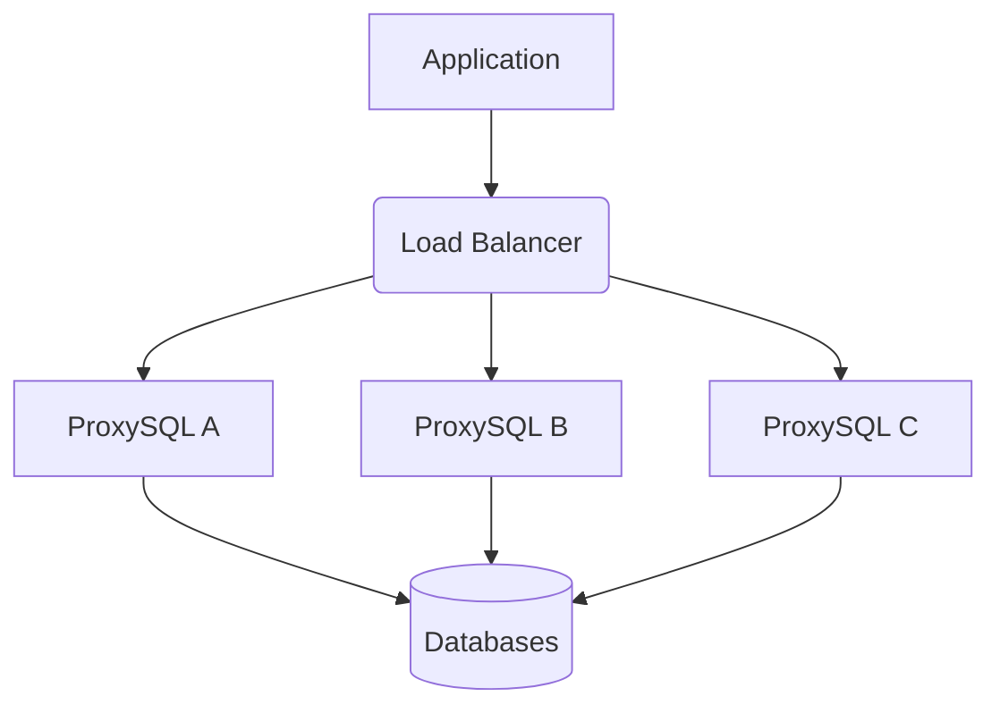
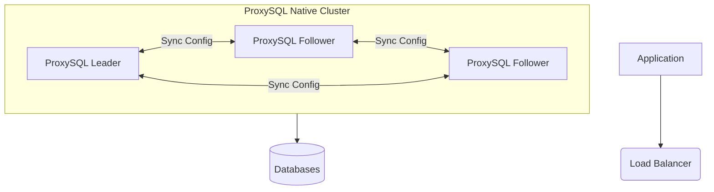
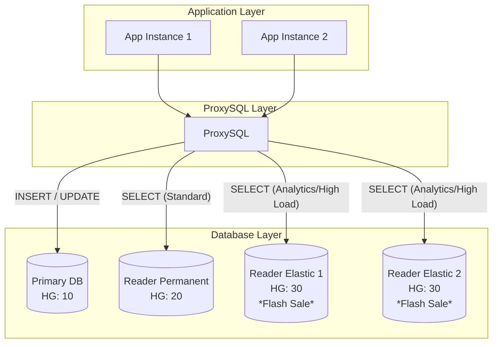
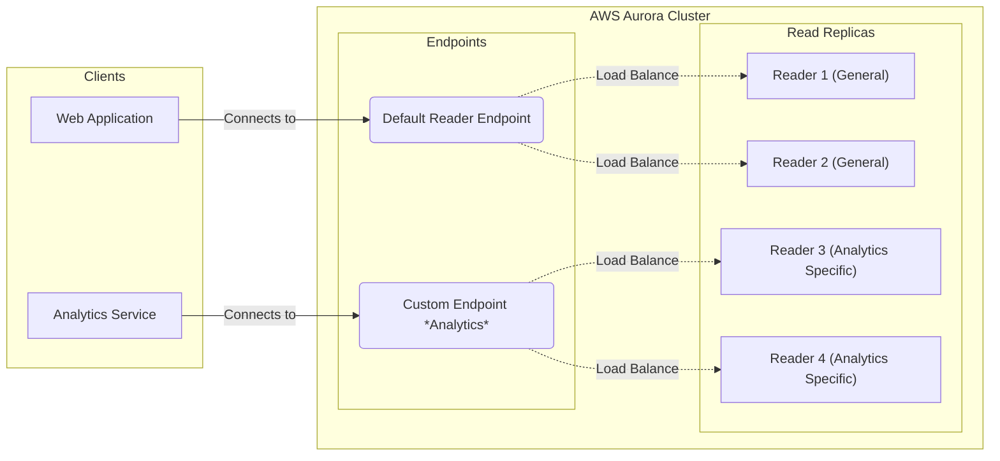

# Understanding Proxy Servers: A Deep Dive into ProxySQL

In the complex landscape of distributed systems, direct communication between clients and backend resources is often inefficient or insecure. Enter the **Proxy Server**—an intermediary that sits between the end-user clients and the resources they intend to browse or access.

In the context of database architecture, a database proxy abstracts the underlying database topology from the application layer. Instead of applications connecting directly to a specific database instance (like a primary or a replica), they connect to the proxy, which then intelligently routes the query to the appropriate destination.

Popular examples in the relational database world include **PgBouncer** for PostgreSQL, which excels at connection pooling, and **ProxySQL** or **MaxScale** for MySQL, which provide advanced features like query routing, caching, and failover management.

## Benefits of Using a Proxy Server

Implementing a proxy server in your database architecture offers several robust advantages:

* **Connection Pooling and Multiplexing**
  Opening and closing database connections is an expensive operation. Proxies maintain a pool of open connections to the backend databases and reuse them for multiple client requests (multiplexing). This drastically reduces the connection overhead on the database server, allowing it to dedicate more resources to executing queries rather than managing network handshakes.

* **Load Balancing and Read/Write Splitting**
  Proxies can distribute incoming traffic across multiple database nodes. By identifying the type of query (e.g., specific `SELECT` statements versus `INSERT`/`UPDATE`s), the proxy can automatically route write operations to the primary node and read operations to read replicas. This ensures optimal resource utilization and prevents a single node from becoming a bottleneck.

* **High Availability and Failover**
  A proxy creates an abstraction layer that insulates the application from database failures. If a database node goes down, the proxy detects the failure and immediately stops sending traffic to that node, rerouting it to healthy instances. This failover happens transparently to the application, which continues to communicate with the proxy without realizing the backend topology has changed.

* **Query Caching**
  Some advanced proxies can cache the results of frequently executed queries in their own memory. If a client requests data that is already cached, the proxy serves the result instantly without ever hitting the backend database. This significantly reduces latency for the application and lowers the load on the database server.

## Deep Dive: ProxySQL for MySQL

ProxySQL is a high-performance, open-source proxy for MySQL (and forks like Percona Server and MariaDB). It is uniquely designed to solve the challenges of high-traffic, highly available database clusters. Unlike simple connection poolers, ProxySQL understands the SQL protocol, allowing it to inspect queries and make intelligent routing decisions based on the actual SQL content, user, or schema.

### The Scenario: Elastic Scaling for Burst Traffic

Let's weave our exploration around a specific, common business scenario:

> **The Use Case:** Imagine an e-commerce platform that experiences a massive surge in traffic only during "Flash Sales" (e.g., 6 PM to 8 PM). During these hours, read traffic spikes by 10x.
>
> **The Strategy:** To handle this cost-effectively, we want an **elastic database topology**. We will spin up additional Read Replicas specifically for the flash sale window and tear them down afterward.
>
> **The Challenge:** We need to add and remove these database nodes dynamically *without* changing application code, *without* redeploying the app, and *without* any downtime.

## Using MySQL to Distribute and Divert Traffic

ProxySQL manages backend servers using **Hostgroups**. A hostgroup is simply a logical grouping of database servers (e.g., Hostgroup 10 for Writers, Hostgroup 20 for Readers).

Let's walk through the configuration steps to achieve our elastic routing.

### a) Configuring Backend Servers

First, we define our backend servers in the `mysql_servers` table.

* **Hostgroup 10:** The Primary Writer (High consistency).
* **Hostgroup 20:** The Permanent Readers.
* **Hostgroup 30:** The "Flash Sale" Elastic Readers (only active during surges).

```sql
-- Connect to ProxySQL Admin interface (usually port 6032)
-- Insert the Writer (Primary)
INSERT INTO mysql_servers (hostgroup_id, hostname, port) 
VALUES (10, 'db-primary', 3306);

-- Insert the Permanent Reader
INSERT INTO mysql_servers (hostgroup_id, hostname, port) 
VALUES (20, 'db-reader-permanent', 3306);

-- Insert the Elastic Readers (initially can be offline or added dynamically)
INSERT INTO mysql_servers (hostgroup_id, hostname, port) 
VALUES (30, 'db-reader-elastic-1', 3306);
```

### b) Significance of LOAD MYSQL SERVERS

When you run the `INSERT` commands above, you are modifying the configuration in **Memory** (specifically, the `main` database in memory). These changes are not yet effective for live traffic.

To apply these changes to the runtime engine (the part of ProxySQL actually handling traffic), you must run:

```sql
LOAD MYSQL SERVERS TO RUNTIME;
```

This command acts as a "commit" to the running process. It tells ProxySQL to start using the new server list immediately without restarting the service.

### c) Significance of SAVE MYSQL SERVERS

While `LOAD` pushes changes to runtime, it does not persist them to disk. If ProxySQL restarts, all changes in memory are lost. To ensure your configuration survives a reboot, you must save them to the internal SQLite database file on disk:

```sql
SAVE MYSQL SERVERS TO DISK;
```

### d) Adding More Replicas (Scaling Out)

When the "Flash Sale" begins, your orchestration tool (like Terraform or Kubernetes) provisions new DB replicas. To register them with ProxySQL:

```sql
-- Adding new elastic nodes for the surge
INSERT INTO mysql_servers (hostgroup_id, hostname, port) 
VALUES (30, 'db-reader-elastic-2', 3306);

INSERT INTO mysql_servers (hostgroup_id, hostname, port) 
VALUES (30, 'db-reader-elastic-3', 3306);

-- Apply changes instantly
LOAD MYSQL SERVERS TO RUNTIME;
SAVE MYSQL SERVERS TO DISK;
```

*The application knows nothing about these new IPs; it just continues talking to ProxySQL.*

### e) Significance of mysql_query_rules

The real magic happens in the `mysql_query_rules` table. This acts as a firewall and router combined. You define rules that match specific criteria (regex on the query, username, schema name, etc.) and assign an action, such as assigning a `destination_hostgroup`.

ProxySQL evaluates rules in order of their `rule_id`.

### f) Routing Based on Query Type (Read/Write Split)

A classic rule is to send all `SELECT` queries to the reader groups (Hostgroup 20 and 30) and everything else to the writer (Hostgroup 10).

```sql
-- Rule: Direct all SELECT statements to Hostgroup 20 (Readers)
INSERT INTO mysql_query_rules (rule_id, active, match_digest, destination_hostgroup, apply)
VALUES (
    100,                 -- rule_id
    1,                   -- active
    '^SELECT.*',         -- match_digest (Regex for queries starting with SELECT)
    20,                  -- destination_hostgroup (Permanent Readers)
    1                    -- apply (Stop processing further rules if this matches)
);

LOAD MYSQL QUERY RULES TO RUNTIME;
SAVE MYSQL QUERY RULES TO DISK;
```

*Note: In production, you might set up a "Replication Lag" check so ProxySQL doesn't send queries to readers that are too far behind the writer.*

### g) Routing Based on Schema (Analytics vs. Transactions)

Suppose you have a specific schema `analytics_db` that runs heavy aggregation queries. You don't want these blocking your transactional users. You can route traffic hitting this specific schema to the elastic hostgroup (Hostgroup 30).

```sql
-- Rule: Direct traffic for schema 'analytics_db' to Hostgroup 30
INSERT INTO mysql_query_rules (rule_id, active, schemaname, destination_hostgroup, apply)
VALUES (
    50,                  -- Lower ID = Higher Priority than the generic SELECT rule
    1, 
    'analytics_db',      -- Exact match on schema name
    30,                  -- Elastic/Analytics Readers
    1
);

LOAD MYSQL QUERY RULES TO RUNTIME;
SAVE MYSQL QUERY RULES TO DISK;
```

### h) Comment/Hint Based Routing

Sometimes regex isn't enough. You might have a critical `SELECT` statement (e.g., checking inventory before checkout) that *must* go to the Writer (Hostgroup 10) to ensure strong consistency, bypassing the replica entirely.

Developers can inject a SQL comment (hint) into the query, and ProxySQL can route based on that comment.

**Example Query from Application:**

```sql
/* forceful_write */ SELECT quantity FROM products WHERE id = 101;
```

**ProxySQL Rule:**

```sql
-- Rule: If query contains "forceful_write", send to Writer (HG 10)
INSERT INTO mysql_query_rules (rule_id, active, match_digest, destination_hostgroup, apply)
VALUES (
    10,                  -- Highest Priority
    1,
    'forceful_write',    -- Regex matching the comment
    10,                  -- Writer Hostgroup
    1
);

LOAD MYSQL QUERY RULES TO RUNTIME;
SAVE MYSQL QUERY RULES TO DISK;
```

This gives developers granular control over routing without hardcoding IP addresses in the application.

## Deployment of ProxySQL

### 1. Fleet of ProxySQL Fronted by a Load Balancer

In this topology, you run multiple independent ProxySQL instances behind a classic Load Balancer (like AWS NLB or HAProxy).



* **Advantages:**
    * **Simple to understand:** Each ProxySQL node is independent.
    * **High Availability:** If one ProxySQL node dies, the Load Balancer removes it.
* **Disadvantages:**
    * **Configuration Drift:** If you add a new query rule to `ProxySQL A`, you must manually apply the exact same SQL commands to `ProxySQL B` and `C`. Automation tools (Ansible/Chef) are required to keep them in sync.
    * **Split Brain Risks:** If configurations diverge, users might get different results depending on which proxy the Load Balancer hits.

### 2. ProxySQL Cluster Mode (Native Clustering)

ProxySQL supports native clustering. You configure the instances to form a cluster, and they automatically synchronize their configuration.



* **Advantages:**
    * **Auto-Synchronization:** You only need to run the `INSERT` and `LOAD` commands on *one* node. The changes are automatically propagated to all other nodes in the cluster.
    * **Management Ease:** Drastically reduces the operational overhead of managing a large fleet.
* **Disadvantages:**
    * **Complexity:** Setting up the internal cluster network requires careful configuration.
    * **Network Overhead:** There is a small amount of traffic between proxies for synchronization.

## Elastic Topology Visualization

Here is how our Elastic/Flash Sale setup looks. The application connects to ProxySQL, which handles the dynamic routing to the elastic fleet.


## AWS Aurora Alternative: Custom Endpoints

If you are hosted specifically on AWS Aurora, you might not always need an external layer like ProxySQL for basic traffic segregation. Aurora offers a native feature called **Custom Endpoints**.

In the AWS Aurora ecosystem, **Custom Endpoints** offer a native alternative to external proxies for routing traffic to specific groups of database instances. Unlike the standard Cluster Reader Endpoint which cycles through *all* available replicas, a Custom Endpoint allows you to arbitrarily group specific instances—such as high-performance nodes—into a distinct VIP. When an application connects to this custom DNS name, Aurora performs DNS-based load balancing to distribute connections across only the pre-selected instances in that group. This feature is ideal for isolating workloads; for example, you can direct heavy analytical reports to a specific set of larger instances while keeping fast transactional reads on smaller instances for the web application. Because it operates at the DNS level, it provides instance-level isolation but lacks the granular query-level routing rules (regex parsing) found in tools like ProxySQL. It simplifies infrastructure management by removing the need for an intermediate proxy layer when simple instance grouping satisfies the routing requirements.

### Visualizing Aurora Custom Endpoints

The following diagram illustrates how a Custom Endpoint acts as a specific entry point, load balancing traffic across a dedicated subset of readers, separate from the general traffic.



### Conclusion

By leveraging ProxySQL, we effectively decoupled our application from the database infrastructure. We achieved the ability to "burst" our read capacity by adding elastic nodes (Hostgroup 30) and routing heavy traffic to them via `mysql_query_rules`. All of this happened transparently to the application, ensuring high availability and cost efficiency during peak business hours.