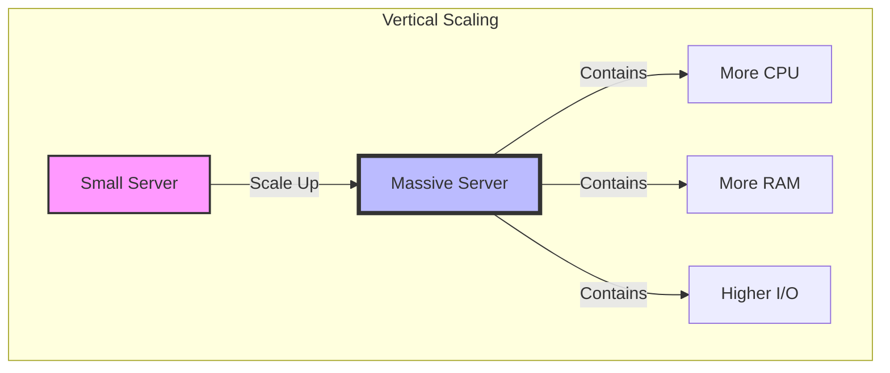
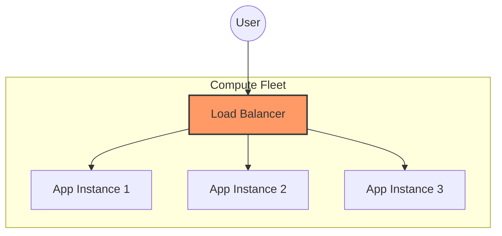
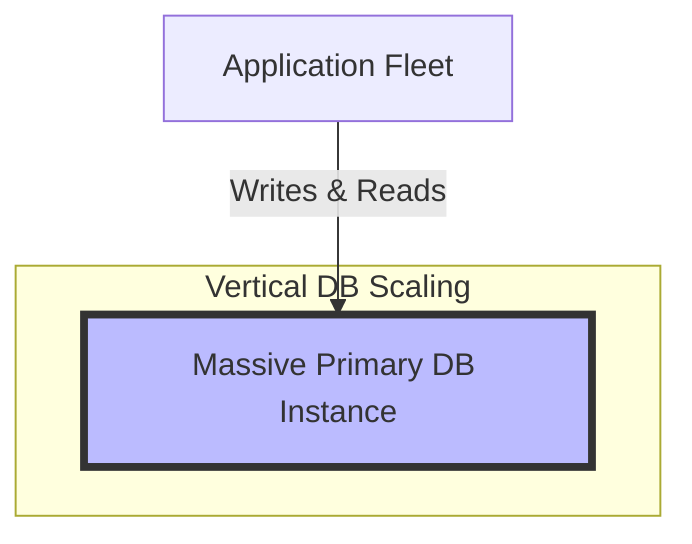
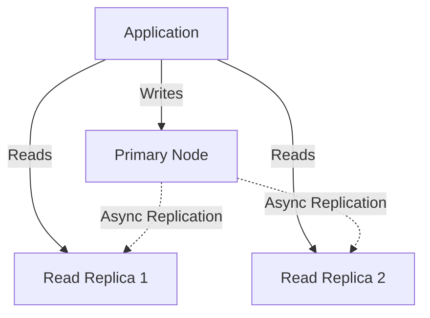
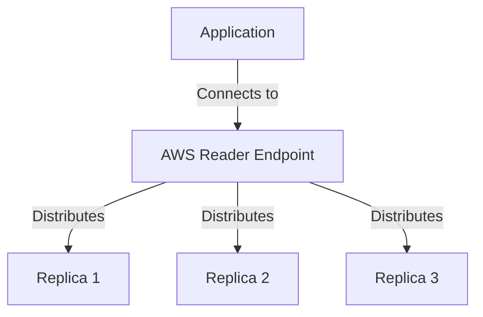
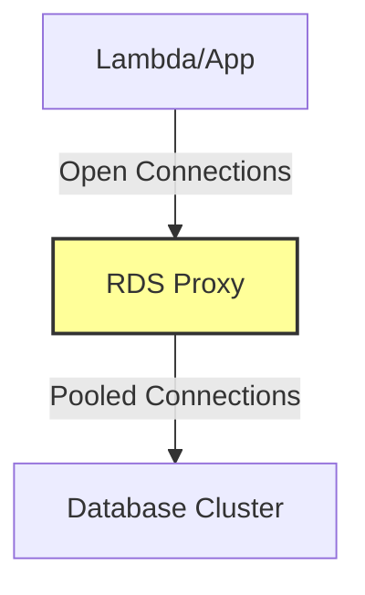
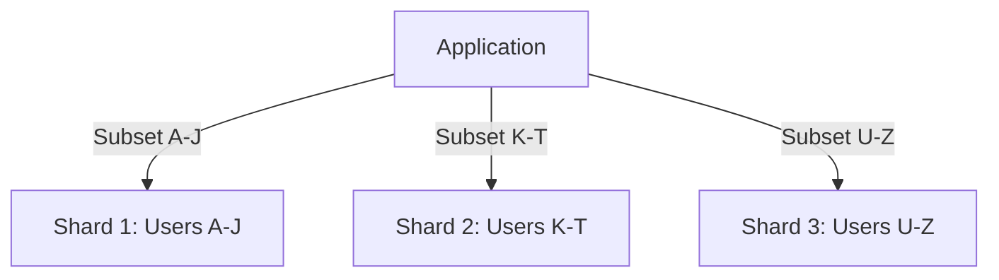

In distributed systems, the four possible chokepoints that a system can run into are **CPU, Memory, Network, and Disk**. Whenever the system hits the thresholds on any of these chokepoints, latency increases, throughput degrades, and we typically need to scale our systems.

Scaling isn't just about "adding more"; it's about *how* and *where* you add capacity. Broadly, we have two strategies:

1.  **Vertical Scaling**
2.  **Horizontal Scaling**

## The Scaling Strategies

### Vertical Scaling (Scale Up)
In Vertical scaling, we aim to solve for bottlenecks by throwing more CPU, memory, disk, and network bandwidth to the application. Basically, we make the infrastructure bulky enough to handle more load and try to remain under the threshold of our resources.

**Pros:** Simplifies operations (no network overhead between nodes, no distributed consensus issues).
**Cons:** Has a hard ceiling (hardware limits) and can get exponentially expensive.

### Horizontal Scaling (Scale Out)
In horizontal scaling, we run multiple instances of the application on multiple machines. Basically, we add more machines to the compute layer. This fleet of compute servers is typically fronted by a load balancer.

As the load increases, the compute layer is linearly scaled to cope with the load. Horizontal scaling also aids in fault tolerance; if one node dies, the others pick up the slack.

:::info The "Unit Tech Economics"

Double-clicking a bit on the phrase *"As the load typically increases, the compute layer is linearly scaled"*: In order for this step to be efficient, it is very important to know the **"Unit Tech Economics"**.

For a given machine of a certain size (i.e., # of CPUs, RAM, Disk, and N/W bandwidth), what is the throughput that can be successfully and healthily served?

There isn't a magic formula for this. Each application needs to be load tested with **one machine** to arrive at the "Unit Tech Economics." Once you have these numbers, all you need to do is extrapolate them to the actual load anticipated in production or during peak hours.
:::

:::caution The "Infinite Scale" Fallacy
Does this mean that with horizontal scaling of the API servers you can achieve infinite scale? **Not really.**

What about your downstream systems, caches, and DBs? Will they be able to serve the spiked-up load? **NO.**

When scaling, one should adopt the **bottoms-up approach**. Scaling API servers should ideally be the last component to be scaled up.
:::
---

## Deep Dive: Scaling the Database

With this context set, let's go deep into the scaling aspects of DBs (stateful components).

### 1. Vertical Scaling
As explained above, with vertical scaling—without splitting your DB instance—you typically host your DB on a bigger server, i.e., a machine with more capacity in terms of CPU, Memory, Disk, and Network. Basically, you run your DB on a bulkier server.

> **Real World Example: Zerodha**
> One of India's largest stock brokers, famously scaled their massive volume by avoiding premature distributed complexity. They run their core systems on a **single, massive Postgres Server**.
>
> **Summary:** Instead of rushing to sharding, Zerodha focused on optimizing queries and utilizing high-end hardware.
> * **How:** They use high-performance hardware (huge RAM to fit working sets in memory) and optimized Postgres configurations.
> * **Pros:** Simplifies architecture (no distributed transactions), ensures strict ACID compliance, and offers low latency.
> * **Cons:** It is a Single Point of Failure (SPOF) if not HA, and restart times can be long due to the sheer size of memory buffers.
>
> *Read more: [Zerodha Tech Blog: Working with PostgreSQL](https://zerodha.tech/blog/working-with-postgresql/)*

### 2. Adding Read Replicas
In this approach, you provision for serving read traffic. Basically, you add one or more DB servers that specifically serve read traffic. This approach helps in reserving the primary node of the DB for writes, effectively isolating read and write traffic.

In terms of reading from the application standpoint, the application need not know about multiple servers. It can leverage a couple of solutions to simplify reader connection management:

#### a) Reader Endpoint (AWS Aurora / RDS)
If you are using AWS Aurora or RDS, you can leverage the **Reader Endpoint**. A reader endpoint is a DNS record exposed by AWS. The application simply connects to this endpoint.

At a high level, one can visualize the reader endpoint as a load balancer sitting in front of the DB readers. It distributes these read requests fairly amongst the available readers.

#### b) RDS Proxy
**What is RDS Proxy?**
Amazon RDS Proxy is a fully managed, highly available database proxy that sits between your application and your relational database.

**Use Cases:**
1.  **Connection Pooling:** It maintains a pool of established connections to your database, sharing them among application requests. This is crucial for serverless applications (like Lambda) that might open thousands of connections quickly.
2.  **Resiliency:** It reduces failover times by bypassing DNS cache propagation delays.

### 3. Sharding
Sharding is **not** a Day 0 approach. You typically do this when you know the user and data volume will exceed the capacity of a vertically scaled single node.

In Sharding, you split the data across multiple primary shards.

**How do you decide where data resides?**

1.  **Range-Based Mapping:**
    * Assume you are a platform serving millions of tenants. You might say: Tenants starting with `a-j` reside in Shard 1, `k-t` in Shard 2, and `u-z` in Shard 3.
2.  **Static Mapping:**
    * In this approach, you maintain a static mapping (lookup table) between tenants and DB shards. E.g., Tenant 1 maps to Shard 1, Tenant 2 maps to Shard 1, Tenant 3 maps to Shard 2, etc.

**Where do you host this mapping logic?**

1.  **Application Layer**
    * We make the application "shard aware." The application **KNOWS** the DB topology and determines which shard a given tenant resides in.
    * The application then connects to the respective DB shard to perform reads and writes.

2.  **External Layer (Smart Proxy)**
    * Instead of the application knowing the topology, a proxy layer **KNOWS** the DB topology.
    * You configure server rules and query rules in the proxy layer. Based on the incoming query, the proxy routes the request to the correct DB shard.

*I have written separate blogs on [Shard Aware Applications](/shard-aware-app-design.md) and [Exteral DB Proxy](/proxy-server.md) to go really deep into BOTH the above techniques (Application vs. Proxy sharding).*