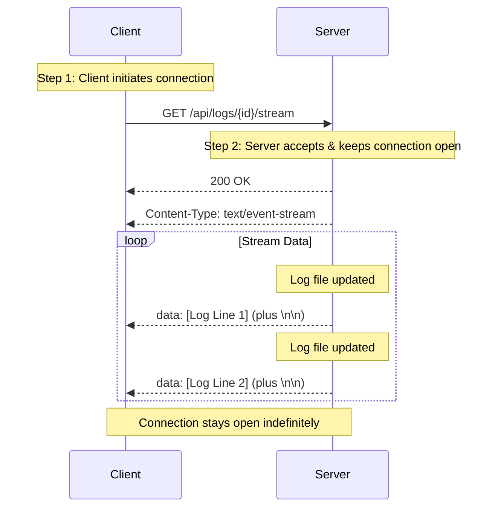

In the world of web development, the classic request-response model serves us well for most interactions. The client asks for data, and the server provides it. But what happens when the server has new data *after* the initial request? How do we push updates to the client in real-time?

While WebSockets are a popular choice for bi-directional communication, they can be overkill for many scenarios. Enter **Server-Sent Events (SSE)**—a standard that allows servers to push data to web pages over a single HTTP connection.

In this post, we will explore what SSE is, typical use cases, the underlying protocol, and a practical implementation using Python and Flask.

## 1. What is Server-Sent Events (SSE)?

Server-Sent Events (SSE) is a technology that enables a client (usually a browser) to receive automatic updates from a server via an HTTP connection. It creates a unidirectional channel: the client opens the connection, and the server keeps it open, pushing text-based messages whenever new data is available.

Think of it like subscribing to a newsletter. You sign up once (the HTTP request), and the publisher sends you updates continuously as they happen, without you needing to ask for them again.

**Key Characteristics:**
* **Unidirectional:** Server -> Client only.
* **Standard HTTP:** Works over standard HTTP/HTTPS.
* **Text-Based:** Sends data as UTF-8 text.
* **Automatic Reconnection:** Browsers automatically attempt to reconnect if the connection drops.

## 2. Typical Use Cases

Since SSE is unidirectional, it is perfect for scenarios where the client needs to be updated, but doesn't need to send high-frequency data back to the server.

* **Live Log Streaming:** Viewing server logs in real-time (as we will see in our example code).
* **Stock Tickers & Crypto Prices:** Updating dashboards with the latest financial data.
* **Progress Indicators:** Showing the progress of long-running tasks (e.g., file uploads, video processing).
* **Sports Scores:** Live updates during a match.

## 3. The Protocol of Server-Sent Events

SSE is deceptively simple. It sits on top of HTTP. Here is how the handshake and data transfer work:

1.  **The Request:** The client sends a standard GET request.
2.  **The Headers:** The server responds with specific headers to keep the connection open:
    * `Content-Type: text/event-stream` (Crucial: tells the client to expect a stream).
    * `Cache-Control: no-cache` (Prevents the browser from caching the stream).
    * `Connection: keep-alive` (Keeps the TCP connection open).
3.  **The Payload:** The server sends data blocks separated by a pair of newlines (`\n\n`).

### The Message Format
Each message in the stream is a block of text. The most common field is `data`.

```text
data: This is a message

data: This is the second message

```

*Note: In the raw protocol, every message must end with two newlines (`\n\n`) to signal the end of the event.*

You can also include event types and IDs:

```text
id: 101
event: update
data: {"status": "processing", "progress": 50}

```

### Visualizing the Flow

Here is a sequence diagram showing how the Client establishes the connection and receives a stream of log data.



## 4. Implementation: Streaming Logs with Python

Let's look at a practical implementation. Below is a Python script using `Flask`. It simulates a system where logs are being written to a file in the background, and a client listens to these logs in real-time via SSE.

### Key Components Explained

There are two critical parts in the code that make SSE work:

#### 1. The Generator Function (`read_log_stream`)
Standard HTTP requests return a block of data and close. To stream, Python uses **generators** (functions that `yield` instead of `return`).

```python
def read_log_stream(log_id: str):
    # ... setup code ...
    while True:
        # Check for new data
        if new_lines:
             for line in new_lines:
                 # Format specifically for SSE
                 yield f"data: {line.rstrip()}\n\n"
        else:
             # Wait briefly to prevent 100% CPU usage
             time.sleep(0.1)
```

This function keeps running. Every time it finds a new line in the log file, it pushes it out using `yield`.

#### 2. The Flask Response (`stream_log`)
Flask needs to know this isn't a normal response. We pass the generator function to `Response` and set the headers.

```python
@app.route("/api/logs/<log_id>/stream", methods=["GET"])
def stream_log(log_id: str):
    return Response(
        read_log_stream(log_id),
        mimetype="text/event-stream",  # Required for SSE
        headers={
            "Cache-Control": "no-cache", # Prevent buffering
            "Connection": "keep-alive"   # Keep connection open
        }
    )
```

#### 3. The Client (`index` route)
On the frontend (embedded in the `index` function), the `EventSource` API handles the heavy lifting.

```javascript
eventSource = new EventSource(`/api/logs/${logId}/stream`);

eventSource.onmessage = function(event) {
    // This runs every time the server sends a "data:" packet
    console.log("New Log:", event.data);
};
```


SSE is a powerful tool in your system design toolkit. While it doesn't replace WebSockets for complex bidirectional needs (like a chat app), it is often the simpler, more efficient choice for one-way updates.

### The Code

```python
import time
import threading
import uuid
import logging
from datetime import datetime
from pathlib import Path
from flask import Flask, request, Response
from faker import Faker

# Configure logging
logging.basicConfig(
    level=logging.DEBUG,
    format='%(asctime)s - %(name)s - %(levelname)s - %(message)s'
)
logger = logging.getLogger(__name__)

app = Flask(__name__)
fake = Faker()

# Directory to store log files
LOG_DIR = Path("../logs")
LOG_DIR.mkdir(exist_ok=True)
logger.info(f"Log directory set to: {LOG_DIR.absolute()}")

# Track active log streams
active_streams = {}


def generate_random_text():
    """Generate random text using Faker"""
    choices = [
        lambda: fake.sentence(),
        lambda: fake.paragraph(),
        lambda: fake.word(),
        lambda: f"[{datetime.now().isoformat()}] {fake.sentence()}",
    ]
    text = choices[id(time.time()) % len(choices)]()
    logger.debug(f"Generated random text: {text[:50]}...")
    return text


def write_to_log(log_id: str, message: str):
    """Write a message to the log file"""
    log_file = LOG_DIR / f"{log_id}.log"
    try:
        with open(log_file, "a") as f:
            f.write(message + "\n")
        logger.debug(f"Wrote to log {log_id}: {message[:50]}...")
    except IOError as e:
        logger.error(f"Failed to write to log {log_id}: {e}")


def simulate_log_writing(log_id: str, duration: int = 30):
    """Simulate writing to log file for a given duration"""
    logger.info(f"Starting log writing thread for log_id={log_id}, duration={duration}s")
    end_time = time.time() + duration
    write_count = 0

    while time.time() < end_time:
        message = generate_random_text()
        write_to_log(log_id, message)
        write_count += 1
        time.sleep(0.5)  # Write every 500ms

    logger.info(f"Finished log writing for log_id={log_id}. Total lines written: {write_count}")


def read_log_stream(log_id: str):
    """Generator that streams log content"""
    log_file = LOG_DIR / f"{log_id}.log"
    logger.info(f"Starting log stream for log_id={log_id}")

    if not log_file.exists():
        logger.warning(f"Log file not found for log_id={log_id}")
        yield f"data: Log file {log_id} not found\n\n"
        return

    # Start reading from beginning
    position = 0
    line_count = 0

    while True:
        try:
            with open(log_file, "r") as f:
                f.seek(position)
                lines = f.readlines()

                if lines:
                    for line in lines:
                        # Protocol: Prefix with "data: " and end with double newline
                        yield f"data: {line.rstrip()}\n\n"
                        line_count += 1
                    position = f.tell()
                    logger.debug(f"Streamed {len(lines)} lines for log_id={log_id}, position={position}")
                else:
                    # No new data, check if log is still being written
                    # In a real app, you might have a mechanism to break if the process is dead
                    logger.debug(f"No new data for log_id={log_id}, waiting...")
                    time.sleep(0.1)
        except IOError as e:
            logger.error(f"Error reading log file for log_id={log_id}: {e}")
            yield f"data: Error reading log file\n\n"
            break

    logger.info(f"Finished streaming log_id={log_id}. Total lines streamed: {line_count}")


@app.route("/api/logs", methods=["POST"])
def create_log():
    """
    Create a new log file and start streaming random content to it.
    Returns the log ID for later reference.
    """
    log_id = str(uuid.uuid4())
    log_file = LOG_DIR / f"{log_id}.log"

    logger.info(f"Creating new log with log_id={log_id}")

    # Create empty log file
    log_file.touch()
    logger.debug(f"Log file created at: {log_file.absolute()}")

    # Write initial message
    write_to_log(log_id, f"[LOG CREATED] {datetime.now().isoformat()}")

    # Start background thread to write random content
    duration = request.args.get("duration", 30, type=int)
    logger.info(f"Starting background thread for log_id={log_id} with duration={duration}s")

    thread = threading.Thread(
        target=simulate_log_writing,
        args=(log_id, duration),
        daemon=True
    )
    thread.start()
    logger.debug(f"Thread started for log_id={log_id}")

    return {
        "log_id": log_id,
        "message": f"Log file created with ID: {log_id}",
        "stream_url": f"/api/logs/{log_id}/stream"
    }, 201


@app.route("/api/logs/<log_id>/stream", methods=["GET"])
def stream_log(log_id: str):
    """
    Stream the log file content using Server-Sent Events.
    Reads from the beginning and continuously streams new content.
    """
    logger.info(f"Stream request received for log_id={log_id}")
    log_file = LOG_DIR / f"{log_id}.log"

    if not log_file.exists():
        logger.warning(f"Stream request for non-existent log_id={log_id}")
        def error_stream():
            yield f"data: Log file {log_id} not found\n\n"
        return Response(error_stream(), mimetype="text/event-stream")

    logger.debug(f"Starting SSE stream for log_id={log_id}")
    return Response(
        read_log_stream(log_id),
        mimetype="text/event-stream",
        headers={
            "Cache-Control": "no-cache",
            "X-Accel-Buffering": "no",
            "Connection": "keep-alive"
        }
    )


@app.route("/api/logs/<log_id>", methods=["GET"])
def get_log_info(log_id: str):
    """Get information about a specific log file"""
    logger.info(f"Info request received for log_id={log_id}")
    log_file = LOG_DIR / f"{log_id}.log"

    if not log_file.exists():
        logger.warning(f"Info request for non-existent log_id={log_id}")
        return {"error": f"Log file {log_id} not found"}, 404

    file_size = log_file.stat().st_size
    created_at = datetime.fromtimestamp(log_file.stat().st_ctime).isoformat()
    logger.debug(f"Log info for log_id={log_id}: size={file_size}, created={created_at}")

    return {
        "log_id": log_id,
        "file_size": file_size,
        "created_at": created_at,
        "stream_url": f"/api/logs/{log_id}/stream"
    }, 200


@app.route("/", methods=["GET"])
def index():
    """Serve a simple HTML client for testing"""
    return """
    <!DOCTYPE html>
    <html>
    <head>
        <title>Log Streaming PoC</title>
        <style>
            body { font-family: monospace; margin: 20px; }
            button { padding: 10px 20px; margin: 10px 0; cursor: pointer; }
            #log-container { 
                border: 1px solid #ccc; 
                padding: 10px; 
                height: 400px; 
                overflow-y: auto; 
                background: #f5f5f5;
                margin: 10px 0;
            }
            .log-line { margin: 2px 0; }
            .status { padding: 10px; border-radius: 5px; margin: 10px 0; }
            .status.success { background: #d4edda; color: #155724; }
            .status.error { background: #f8d7da; color: #721c24; }
        </style>
    </head>
    <body>
        <h1>Log Streaming Proof of Concept</h1>
        
        <div>
            <button onclick="createLog()">Create New Log</button>
            <input type="number" id="duration" placeholder="Duration (seconds)" value="30" min="5" max="300">
        </div>
        
        <div id="status"></div>
        
        <div>
            Log ID: <input type="text" id="log-id" placeholder="Enter log ID or create new">
            <button onclick="startStream()">Start Streaming</button>
            <button onclick="stopStream()">Stop Streaming</button>
        </div>
        
        <div id="log-container"></div>
        
        <script>
            let eventSource = null;
            
            async function createLog() {
                const duration = document.getElementById('duration').value;
                const statusDiv = document.getElementById('status');
                
                try {
                    const response = await fetch('/api/logs?duration=' + duration, { method: 'POST' });
                    const data = await response.json();
                    
                    document.getElementById('log-id').value = data.log_id;
                    statusDiv.innerHTML = `<div class="status success">✓ Log created: ${data.log_id}</div>`;
                    
                    // Auto-start streaming
                    setTimeout(() => startStream(), 500);
                } catch (error) {
                    statusDiv.innerHTML = `<div class="status error">✗ Error: ${error.message}</div>`;
                }
            }
            
            function startStream() {
                const logId = document.getElementById('log-id').value;
                const statusDiv = document.getElementById('status');
                
                if (!logId) {
                    statusDiv.innerHTML = '<div class="status error">✗ Please create or enter a log ID</div>';
                    return;
                }
                
                if (eventSource) {
                    eventSource.close();
                }
                
                const logContainer = document.getElementById('log-container');
                logContainer.innerHTML = '';
                
                eventSource = new EventSource(`/api/logs/${logId}/stream`);
                statusDiv.innerHTML = `<div class="status success">✓ Streaming logs...</div>`;
                
                eventSource.onmessage = function(event) {
                    const line = document.createElement('div');
                    line.className = 'log-line';
                    line.textContent = event.data;
                    logContainer.appendChild(line);
                    logContainer.scrollTop = logContainer.scrollHeight;
                };
                
                eventSource.onerror = function(error) {
                    statusDiv.innerHTML = '<div class="status error">✗ Streaming stopped</div>';
                    eventSource.close();
                };
            }
            
            function stopStream() {
                if (eventSource) {
                    eventSource.close();
                    eventSource = null;
                }
                document.getElementById('status').innerHTML = '<div class="status">Streaming stopped</div>';
            }
        </script>
    </body>
    </html>
    """, 200


if __name__ == "__main__":
    logger.info("=" * 60)
    logger.info("Starting Log Streaming PoC Service...")
    logger.info("=" * 60)
    print("Starting Log Streaming PoC Service...")
    print("Open http://localhost:5000 in your browser")
    logger.info("Service listening on [http://127.0.0.1:5000](http://127.0.0.1:5000)")
    app.run(debug=True, port=5000)
```

