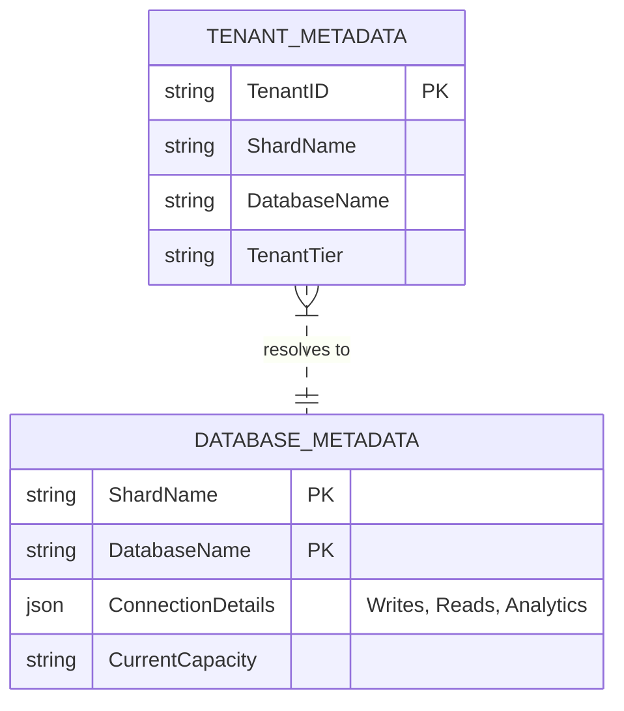
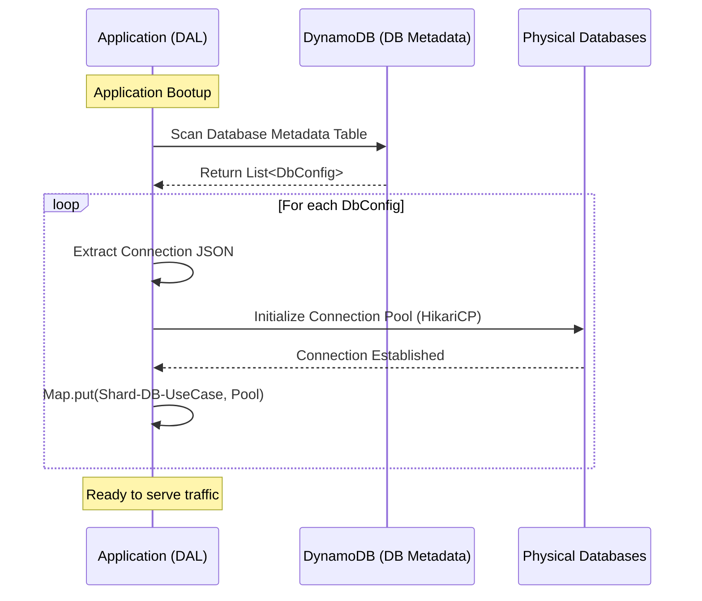
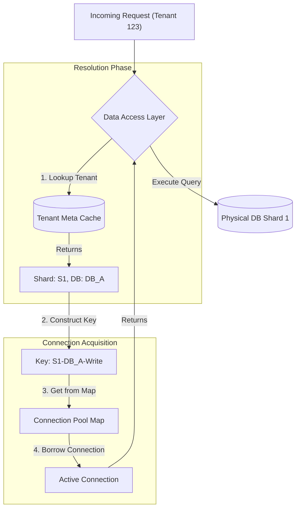

In my previous [post](/scaling.md), we explored the high-level strategies for scaling databases, touching upon vertical scaling, read replicas, and finally, sharding. Today, I want to double-click on **Sharding**, specifically focusing on the **Application-Level Sharding** strategy.

We often talk about "making the application shard-aware," but what does that look like in code? How do we manage thousands of connections without overwhelming the application or the database? How do we handle re-sharding without downtime?

In this post, I will walk you through a battle-tested architecture we implemented at a previous organization, where we managed multi-tenant data at scale using a custom **Data Access Layer (DAL)**.

## The Metadata Control Plane

To build a robust shard-aware application, you cannot hardcode connection strings or shard logic. You need a dynamic **Control Plane**. We solved this by externalizing our topology into two DynamoDB tables.

### 1. Database Metadata
This table acts as the source of truth for the physical infrastructure. It decouples the *logical* definition of a database from its *physical* connection details.

* **Key:** `ShardName` + `DatabaseName`
* **Attributes:**
    * `ConnectionDetails` (JSON): Contains endpoints for different use cases (Write, Read, Analytics), credentials, and schema names.
    * `CapacityMetrics`: Tracks the current load (e.g., number of Small/Medium/Large tenants) to aid in placement decisions for new tenants.

### 2. Tenant Metadata
This table serves as the routing directory. It maps a specific tenant to a logical shard.

* **Key:** `TenantID`
* **Attributes:**
    * `ShardName`: The logical shard where this tenant resides.
    * `DatabaseName`: The specific database instance within that shard.

### The Logical Relationship

By splitting these concerns, we create a normalized view of our topology. The Tenant Metadata points to a logical location, and the Database Metadata resolves that location to physical credentials.

---

## The Bootup Sequence: `initializeDB()`

Efficiency is paramount. We cannot fetch connection details from DynamoDB for every single query. Instead, we cache and initialize heavy resources during application startup.

When the application boots, the **Data Access Layer (DAL)** performs the following `initializeDB()` routine:

1.  **Fetch Topology:** It scans the `Database Metadata` table to understand the entire available fleet.
2.  **Pool Creation:** For every unique combination of `Shard` + `Database` + `UseCase` (Read/Write), it initializes a connection pool (e.g., HikariCP).
3.  **In-Memory Map:** These pools are stored in a concurrent map, keyed by the logical topology identifier.

This ensures that all expensive TCP handshakes are done eagerly, and the app is ready to serve traffic immediately upon becoming healthy.

---

## Runtime Request Handling: `getConnection(tenantId)`

Once the application is running, the focus shifts to low-latency routing. When a request comes in for `Tenant-123`, the DAL needs to find the correct connection seamlessly.

The API exposed to the upper layers is simple: `getConnection(Long tenantId)`.

1.  **Lookup:** The DAL queries the `Tenant Metadata` (often cached locally with a TTL) to find the `ShardName` and `DatabaseName` for the tenant.
2.  **Resolution:** It constructs the lookup key for the in-memory map.
3.  **Acquisition:** It borrows a connection from the pre-warmed pool and hands it to the request thread.

---

## The Strategic Benefits

Implementing this logic within a library provides two massive architectural advantages that go beyond simple connectivity.

### 1. Logical Representation of Infrastructure
The application code never touches a raw JDBC URL.
* **Scenario:** You need to rotate database credentials or migrate a database to a new host URL.
* **Action:** You simply update the JSON in the `Database Metadata` table and trigger a refresh event in the application.
* **Result:** The DAL re-initializes the specific pool. No code deployment is required. The infrastructure is now configuration-driven.

### 2. Logical Mapping & Zero-Downtime Migration
The mapping between a tenant and a database is fluid, not static.
* **Scenario:** `Tenant-ABC` has grown too large for `Shard-1` and needs to be moved to `Shard-2`.
* **Action:** After replicating the data to `Shard-2`, you simply update the `Tenant Metadata` table for `Tenant-ABC`.
* **Result:** The very next request for `Tenant-ABC` will resolve to `Shard-2`. The application layer requires zero changes to support tenant migration, enabling seamless re-balancing of the fleet.

## Conclusion

Building a shard-aware application is an exercise in **separation of concerns**. By isolating the *topology* (Tenant Metadata) from the *infrastructure* (Database Metadata) and wrapping it all in a smart Data Access Layer, you gain the flexibility to scale, migrate, and manage your data tier without constantly refactoring your application code.