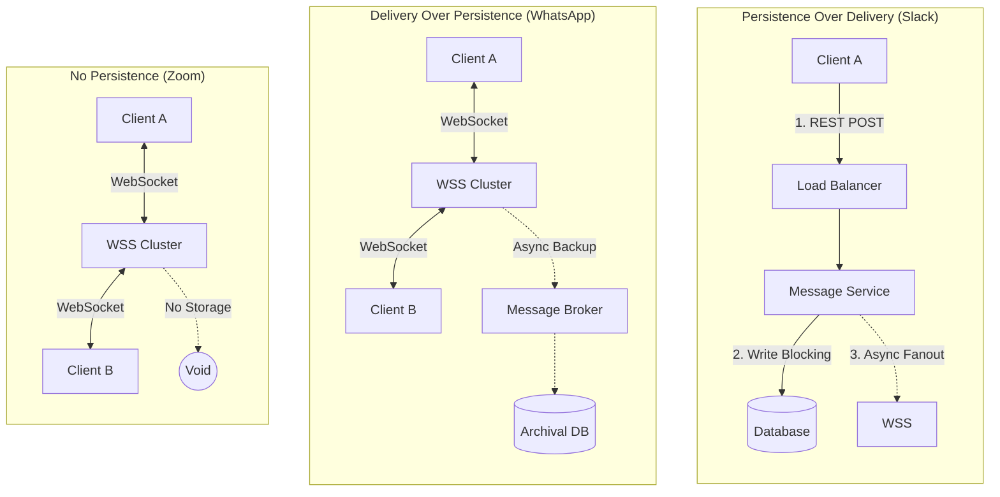
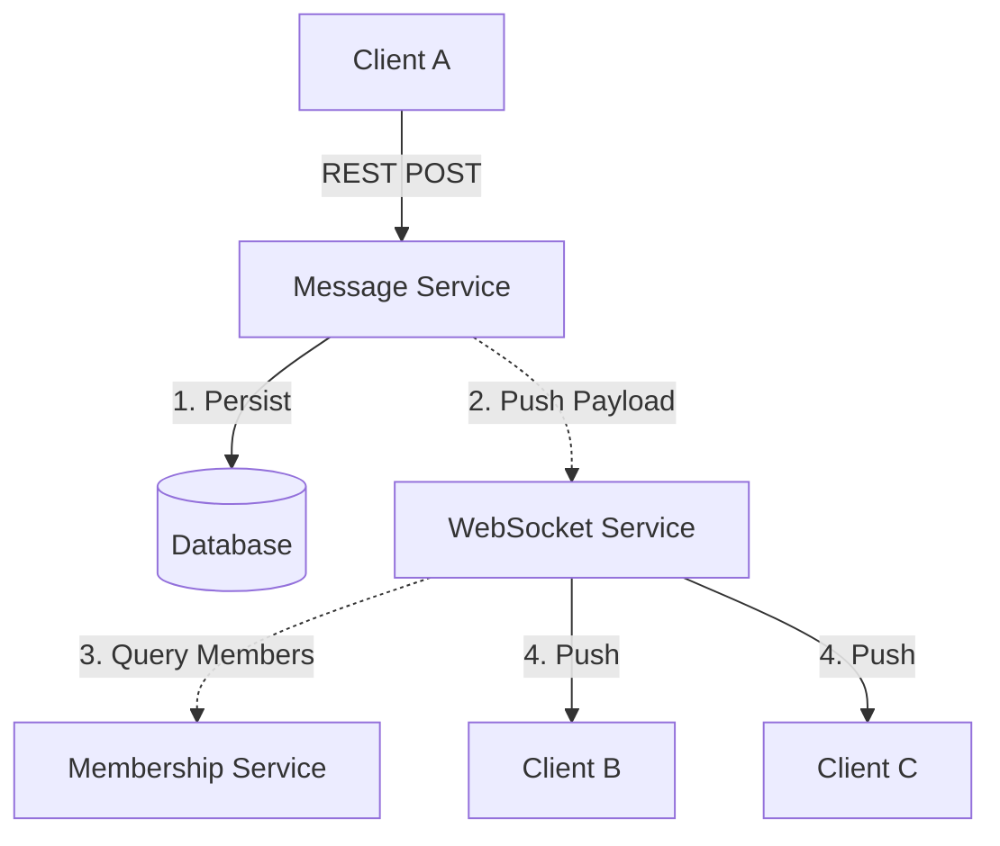
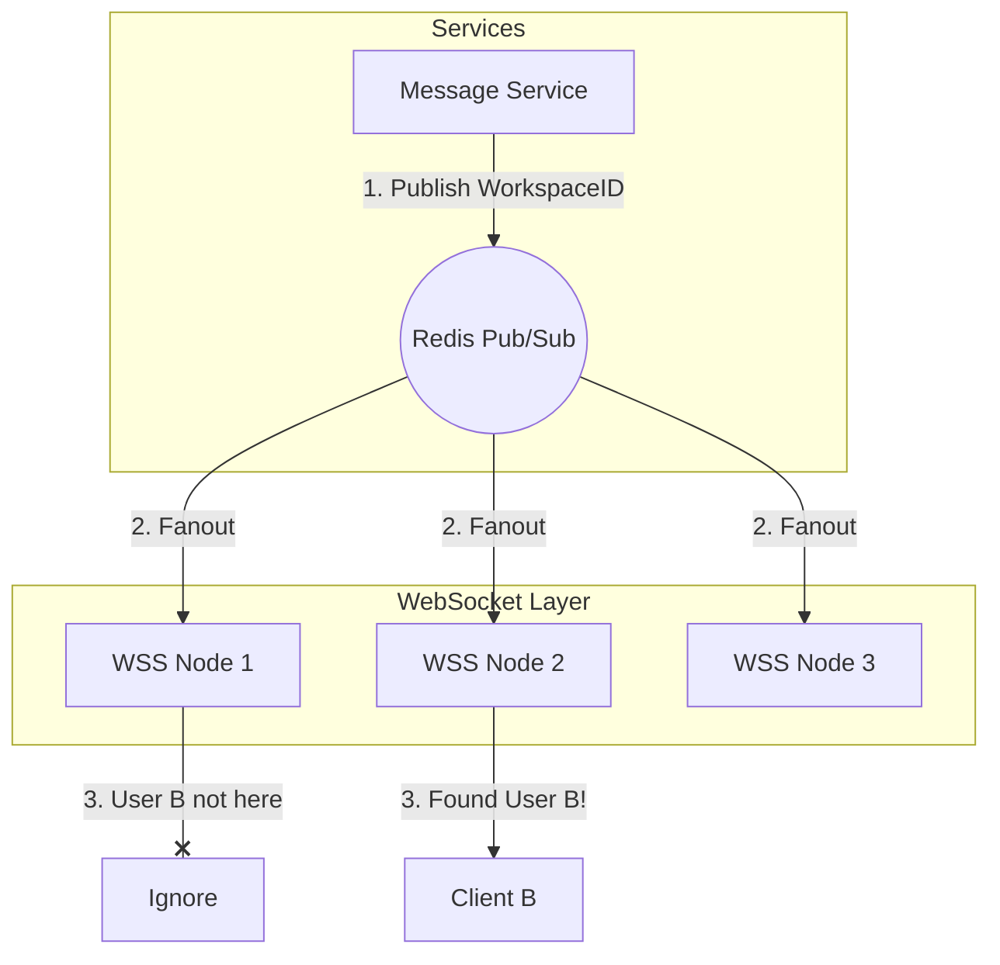
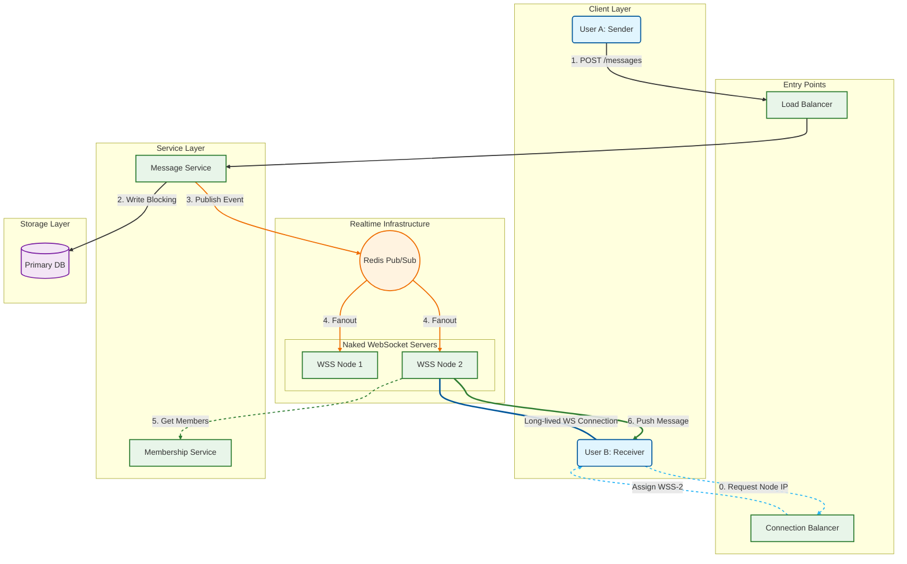

In this post, we will deep dive into the architecture of an enterprise-grade realtime communication system like Slack. We will categorize different communication patterns, design the database schema for performance, and evolve the system architecture from a simple REST service to a scalable, distributed websocket cluster.

## 1. Categorization of Communication Systems

Not all chat applications are built the same. The architectural choices depend heavily on the business requirements regarding **Persistence** (saving the message) versus **Delivery** (getting the message to the recipient).

### The Three Scenarios

We can visualize the three main architectural patterns in the diagram below:



### Deep Dive: Persistence vs. Delivery

#### 1. Persistence Over Delivery (Slack/Teams)
This is the standard for **Enterprise Grade** systems.
* **Why?** In an enterprise setting, the "Source of Truth" is the server. If a user logs in from a new device, they must see the entire history. Regulatory compliance often mandates that data is never lost.
* **The Mechanic:** We must guarantee the message is saved to the database *before* we attempt to deliver it. Delivery is a secondary side-effect of persistence. If the DB write fails, the message is not sent.

#### 2. Delivery Over Persistence (WhatsApp)
This leverages **Local Storage**.
* **Why?** Speed and Privacy. By prioritizing delivery, the app feels "snappy." The server often acts as a router.
* **The Mechanic:** The delivery to the recipient is the primary goal. Persistence might happen asynchronously or only on the user's local device. If the server crashes, the message might still exist on the phones, but not in the cloud.

#### 3. Realtime No Persistence (Zoom Chat)
This is **Ephemeral**.
* **Why?** Contextual relevance. The chat is only relevant while the video session is active.
* **The Mechanic:** Data flows through the WebSocket server and is immediately discarded. If you join a meeting late, the history is gone because it was never saved.

---

## 2. Designing the Core Schema

Data modeling is the foundation of scale. Let's look at how a naive approach fails and how to fix it.

### The Naive Schema

* **Users:** `id`, `name`, `email`
* **Channels:** `id`, `name`
* **Messages:** `id`, `sender_id`, `message`, `created_at`, `receiver_id` (Nullable: set if DM)

**The Problematic Query:**
When User A opens a DM with User B, we need to fetch their history:

```sql
SELECT * FROM messages 
WHERE (receiver_id = 'B' AND sender_id = 'A') 
   OR (receiver_id = 'A' AND sender_id = 'B') 
ORDER BY created_at DESC;
```

:::danger Why this query fails at scale
**1. Complex Filtering:** The database engine has to evaluate `OR` conditions involving two different columns (`sender_id` and `receiver_id`). This often prevents the effective use of single-column indexes, potentially leading to a **Table Scan**.
**2. Time Complexity:** If you have billions of messages, a scan is **$O(N)$**. Even with separate indexes, merging results for the `OR` clause is expensive.
**3. Sorting:** Sorting by `created_at` on a massive dataset without a covering index adds significant overhead.
:::

### The Optimized Schema

To fix this, we need to change how we view Direct Messages (DMs).

:::tip Insight: DM's are just Channels
**We portray a DM as a single channel with exactly two participants.**
:::

By normalizing DMs into the "Channels" concept, we simplify our access patterns significantly.

**New Schema:**
* **Channels:** `id`, `name`, `type` (ENUM: 'DM', 'GROUP_CHANNEL')
* **Messages:** `id`, `sender_id`, `message`, `channel_id`, `created_at`
    * *Index:* `CREATE INDEX idx_channel_created ON messages (channel_id, created_at);`

**The Optimized Query:**
Now, whether it is a Group Channel or a DM, the query is identical:

```sql
SELECT * FROM messages 
WHERE channel_id = ? 
ORDER BY created_at DESC 
LIMIT 20;
```

:::success Why this is faster
**1. Index Utilization:** We are querying on a single column `channel_id`. This allows the DB to use a B-Tree index to jump directly to the relevant block of data.
**2. Time Complexity:** The lookup becomes **$O(\log N)$** (to find the channel node in the B-Tree) + **$O(K)$** (to read the K limit messages).
**3. Pre-sorted:** By including `created_at` in the composite index, the data is already physically stored or indexed in the correct order. The DB doesn't need to perform a separate sort operation.
:::

---

## 3. Defining APIs and Protocols

We will build the system iteratively, starting with the Persistence layer.

### 1. API to Get Messages (Scroll)
* **Endpoint:** `GET /scroll?channel_id={id}&offset={id}`
* **Usage:** Called when a user clicks a channel or scrolls up.
* **Architecture:** Simple REST call.

### 2. API to Send Messages
* **Endpoint:** `POST /messages`
* **Payload:** `{ "channel_id": "123", "message": "Hello World" }`

:::info Design Decision: REST vs WebSocket for Sending
We intentionally use **REST** for sending messages to enforce **Persistence Over Delivery**.
1. The client sends a POST request.
2. The server writes to the DB.
3. Only on a successful DB write does the server acknowledge (200 OK) to the sender.
   This guarantees that if the sender thinks the message is sent, it is definitely saved.
   :::

### 3. Delivering the Message (WebSockets)

Once the message is saved via REST, we need to push it to other users in real-time. We introduce a **WebSocket Service (WSS)**.

* **WSS Role:** Maintains long-lived TCP connections with clients.
* **Membership Service:** The WSS needs to know *who* to send the message to. It queries the Membership Service to find all users in `channel_id`.

**Current Architecture State:**



---

## 4. Scaling Websockets (Redis Pub/Sub)

A single WebSocket server cannot hold millions of connections. We must scale out horizontally.
* **Problem:** If Client A is connected to `WSS-1` and Client B is connected to `WSS-2`, how does `WSS-1` send a message to Client B?
* **Solution:** Redis Pub/Sub.

**The Strategy: Channel per Workspace**
1.  We create a Redis Channel for every generic Workspace (e.g., "Intuit Workspace").
2.  All WSS instances subscribe to the Redis channels for the workspaces they are currently serving users for.
3.  The Message Service publishes the message to the specific Redis Workspace Channel.
4.  Redis fans the message out to all WSS instances subscribed to that workspace.
5.  Each WSS instance checks its local connection list: "Do I have User B?" If yes, it sends the message.



---

## 5. Naked Servers & Connection Balancing

How does a client know *which* WSS node to connect to? We cannot expose WSS nodes directly behind a standard Load Balancer because we need sticky, long-lived connections and intelligent routing.

**The Solution: Connection Balancer**
1.  **Discovery:** Client calls `GET /connect`.
2.  **Logic:** The Connection Balancer checks the health and load of all WSS nodes (via a Heartbeat mechanism).
3.  **Assignment:** It returns the IP/URL of the best available WSS node (e.g., `wss://node-5.slack.com`). This is known as the "Naked Server" pattern because the client connects directly to the node, bypassing a reverse proxy for the websocket pipe.
4.  **Failover:** If `node-5` stops sending heartbeats, the Connection Balancer marks it as unhealthy. Clients disconnected from `node-5` will poll the Balancer again and be assigned to a new node.

---

## Final Architecture & Flow Walkthrough

Below is the complete system design. We have organized the architecture into logical layers to illustrate how the **REST (Sending)** path and **WebSocket (Receiving)** path operate in parallel yet converge at the data and Pub/Sub layers.



### Detailed Flow Walkthrough

1.  **Connection Handshake (Blue Dotted Line):**
    * **User B (Receiver)** opens the app.
    * The client polls the **Connection Balancer** (Step 0) to find a healthy WebSocket server.
    * The Balancer assigns **WSS Node 2**.
    * User B establishes a direct, long-lived "naked" TCP/WebSocket connection with WSS Node 2.

2.  **Sending (Black Path):**
    * **User A (Sender)** sends a message via **REST POST** to the Load Balancer (Step 1).
    * The **Message Service** writes the message to the **Primary DB** (Step 2).
    * *Constraint:* The server waits for the DB acknowledgment (`ACK`) before responding `200 OK` to User A. This ensures **Persistence**.

3.  **Internal Routing (Orange Path):**
    * Once persisted, the Message Service publishes an event to **Redis Pub/Sub** (Step 3).
    * Redis fans this message out to *all* WebSocket Servers (Step 4) that are subscribed to the user's workspace channel.

4.  **Delivery (Green Path):**
    * **WSS Node 1** receives the event, checks its internal map, sees it has no connection for User B, and ignores it.
    * **WSS Node 2** receives the event. It queries the **Membership Service** (Step 5) to resolve channel members.
    * It identifies that it holds the active socket for User B.
    * It pushes the message payload down the open WebSocket connection to **User B** (Step 6).