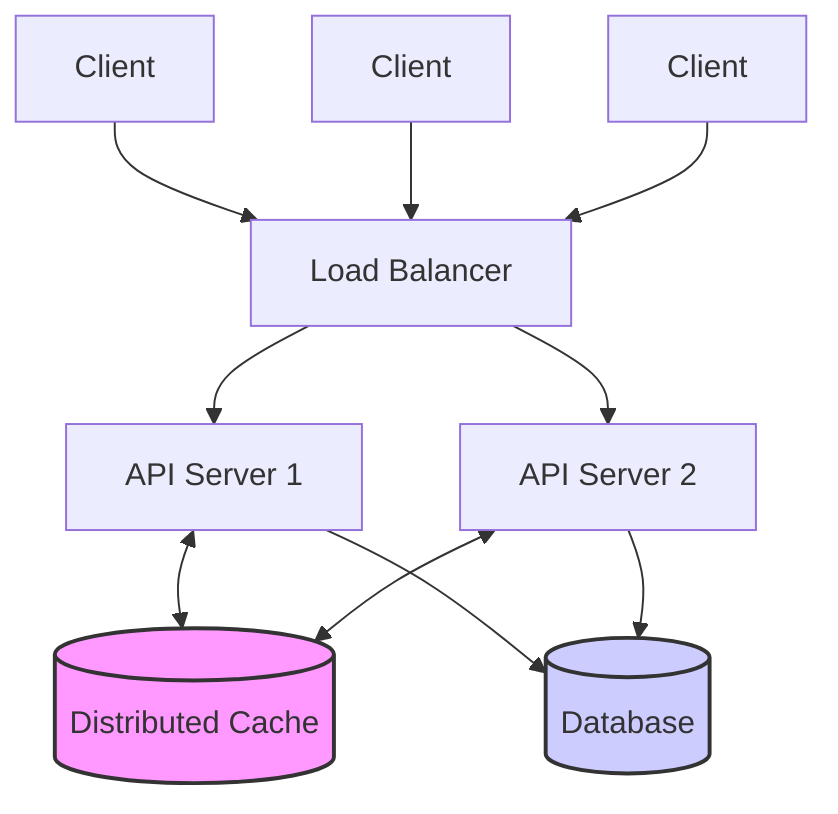

# **The Thundering Herd: Understanding and Solving the Cache Stampede Problem**

In the world of high-scale distributed systems, caching is our best friend. It’s the primary defense layer that protects our fragile databases from the onslaught of user traffic, ensuring low latency and high throughput.

But what happens when that defense layer momentarily fails exactly when you need it most?

Welcome to the **Cache Stampede** problem—also known as the "Thundering Herd." It's a scenario where the very mechanism designed to speed up your system ends up bringing it to its knees.

Let's dive into what it is, why it happens, and the practical techniques used by major systems (like CDNs) to solve it.

## **The Typical Architecture**

Before things go wrong, let's look at how things go right.

Consider a standard three-tier web architecture. We have API servers fronted by a load balancer. Sitting between these API servers and the "source of truth" (the Database) is a caching layer (like Redis or Memcached).

The goal of the cache is simple: serve data fast and reduce load on the database.

Here is a high-level view of this architecture:




### **The "Happy Path" Flow**

Under normal operation, the flow for retrieving data is a standard "Read-Through" cache pattern:

1. The API Server receives a request for a specific key.
2. It first checks the cache.
3. **Cache Hit:** If the data is there, return it immediately. (Fast\!)
4. **Cache Miss:** If the data is *not* there:
    * Query the Database (Slow).
    * Populate the cache with the result for future requests.
    * Return the result to the client.

Here is what this typically looks like in simple Java pseudo-code:

```java
public class SimpleDataService {

    private Cache cache;  
    private Database db;

    public String getData(String key) {  
        // 1. Try fetching from cache  
        String cachedValue = cache.get(key);  
        if (cachedValue != null) {  
            return cachedValue;  
        }

        // 2. Cache miss - fetch from source of truth  
        String dbValue = db.query(key);

        // 3. Backfill cache for next time  
        // Note: Often done with a Time-To-Live (TTL) to ensure freshness  
        cache.put(key, dbValue, Duration.ofMinutes(5)); 

        return dbValue;  
    }  
}
```


This works perfectly fine for normal traffic loads. The database only sees an occasional read when cache items expire.

---

## **The Problem: The Stampede Begins**

Now, imagine a scenario where a piece of content goes viral.

Suddenly, you have thousands of concurrent requests hitting your load balancer for the exact same resource key (e.g., product\_details\_123).

If the cache entry for product\_details\_123 has just expired, or perhaps was evicted due to memory pressure, you have a problem.

In that brief window of time—perhaps just a few hundred milliseconds before the first request can refill the cache—**every single concurrent request will result in a Cache Miss.**

If 5,000 requests arrive simultaneously for that missing key, all 5,000 requests will bypass the cache and bombard your database at the exact same moment.

Your database, which was happily serving a few dozen requests per second, suddenly receives thousands. CPU spikes, connection pools become exhausted, queries time out, and the database might even crash. This is the Cache Stampede. It defeats the entire purpose of having a cache.

## **The Solution: Request Hedging (Debouncing)**

To handle this, we need to ensure that when a "hot" cache key is missing, we don't let the entire herd stampede to the database. We need to designate a leader.

We leverage a technique known as **Request Hedging** or **Debouncing**.

The concept is straightforward: Out of the thousands of concurrent requests for the missing key, we allow **only one** to proceed to the database. All other requests for that same key must **wait** until that first request completes the job and refills the cache. Once the cache is refilled, the waiting requests can read the data from the cache and proceed.

The idea is simple, but as always, the devil is in the implementation details. How do we make requests wait efficiently and cleanly in a highly concurrent environment? Let's look at two approaches in Java.

### **Approach 1: The Busy Wait (Spinlock)**

In this technique, if a thread finds a cache miss, it enters a loop where it continuously checks the cache again after sleeping for a tiny duration. It "spins" until data appears.

#### **Pseudo-code (Busy Wait)**

```java
public class BusyWaitDataService {

    private Cache cache;  
    private Database db;

    public String getData(String key) {  
        String value = cache.get(key);  
          
        // If cache hit, return immediately  
        if (value != null) return value;

        // Determine if I am the "leader" responsible for fetching.  
        // Use an atomic operation like 'setIfAbsent' (NX) in Redis.  
        // Set a short TTL on this lock to prevent deadlocks if the service crashes.  
        boolean acquiredLock = cache.setIfAbsent("lock::" + key, "locked", Duration.ofSeconds(5));

        if (acquiredLock) {  
            try {  
                // I am the leader. Fetch from DB.  
                value = db.query(key);  
                cache.put(key, value, Duration.ofMinutes(5));  
            } finally {  
                // Release lock so others know fetching is done  
                cache.delete("lock::" + key);  
            }  
        } else {  
            // I am a follower. Spin and wait.  
            while (value == null) {  
                try {  
                    // Sleep briefly to avoid hammering CPU  
                    Thread.sleep(50);   
                } catch (InterruptedException e) { Thread.currentThread().interrupt(); }  
                  
                // Check cache again  
                value = cache.get(key);  
                  
                // Optional: Check if lock still exists, if not, break and retry fetch  
            }  
        }  
        return value;  
    }  
}
```


#### **The Downside**

As the name suggests, this approach makes the CPU "busy." Even though the threads are sleeping, the constant context switching and polling consumes precious CPU cycles. In high-load scenarios, this wasted CPU can become substantial. It works, but it's not elegant.

### **Approach 2: The Wait/Notify Mechanism (JVM Locks/Futures)**

A far more efficient approach is to use native concurrency constructs. Instead of polling, threads should block and go to sleep until they are explicitly notified that the data is ready.

In modern Java, a CompletableFuture combined with a ConcurrentHashMap is a robust way to implement this "promise" pattern without getting tangled in low-level monitor locks (synchronized/wait/notify).

#### **Pseudo-code (Wait/Notify with Futures)**

We maintain a local map of "pending database operations." If a request comes in and an operation is already pending for that key, we hook into that existing operation's future result.

```java
import java.util.concurrent.*;

public class BlogService {
   // "use threadsafe implementation here"
   // sem_map: Tracks which keys are currently being fetched
   private final ConcurrentHashMap<String, CountDownLatch> semMap = new ConcurrentHashMap<>();

   // res_map: Temporary storage for followers to grab the result immediately
   // Note: In a real impl, this might need a TTL (e.g., "1 min" per your note) or explicit cleanup
   private final ConcurrentHashMap<String, String> resMap = new ConcurrentHashMap<>();

   public String getBlog(String k) {
      // 1. Check main cache first
      String v = cache.get(k);
      if (v != null) {
         return v;
      }

      // 2. Check Semaphore Map (Thread-safe check)
      // We attempt to create a "lock" (Latch) for this key.
      CountDownLatch myLatch = new CountDownLatch(1); // Starts "blocked"

      // "s = sem_map.get(k)" equivalent using atomic putIfAbsent
      // If returns value: someone else is already fetching (we are follower)
      // If returns null: we successfully inserted (we are leader)
      CountDownLatch existingLatch = semMap.putIfAbsent(k, myLatch);

      if (existingLatch != null) {
         // --- FOLLOWER PATH ("if s: s.wait()") ---
         try {
            // Wait for the leader to signal
            existingLatch.await();
            return resMap.get(k);
         } catch (InterruptedException e) {
            Thread.currentThread().interrupt();
            return null;
         }
      } else {
         // --- LEADER PATH ("else") ---
         try {
            v = db.query(k);

            // "cache.put(k, v)"
            cache.put(k, v);

            // "res_map[k] = v" (Temporary map)
            resMap.put(k, v);

            return v;
         } finally {
            // Open the gate for followers
            myLatch.countDown();

            //Cleanup lock
            semMap.remove(k);

            // Optional: You might schedule resMap cleanup here or rely on TTL
         }
      }
   }
}
```


#### **The Benefit**

This approach is highly efficient. Waiting threads are parked by the OS and consume virtually no CPU until the leader thread completes the future. It handles concurrency cleanly within a single JVM.

### **The Pragmatic Scope: JVM vs. Distributed Locks**

A sharp observer might notice a slight flaw in Approach 2. The guardrails of approach 2 exist within the memory of a *single* API server JVM.

If you have a fleet of 20 API servers behind your load balancer, and a stampede occurs, *one* request on *each* of the 20 servers will proceed to the database.

Instead of 5,000 database hits, you will have 20 hits.

Is this perfect? No. To reduce it to exactly one global hit, you would need a **Distributed Lock** system (using Redis, Zookeeper, or etcd) to coordinate locking across all 20 servers.

However, distributed locks introduce significant complexity, latency, and a new point of failure.

**In practice, the JVM-level solution is often the pragmatic choice.** Reducing 5,000 simultaneous requests down to 20 is usually sufficient to save the database. It's a massive improvement for relatively low implementation complexity.

It's worth noting that large-scale Content Delivery Networks (CDNs) like Cloudflare, Akamai, and Fastly use exactly this hedging technique at their edge locations to protect customer origin servers from getting overwhelmed when content goes viral.