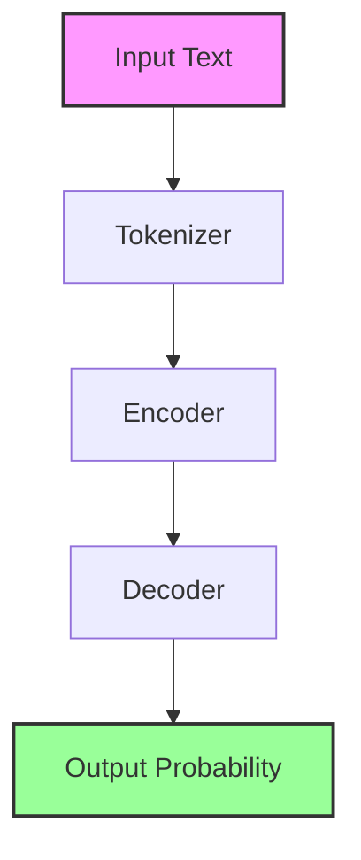
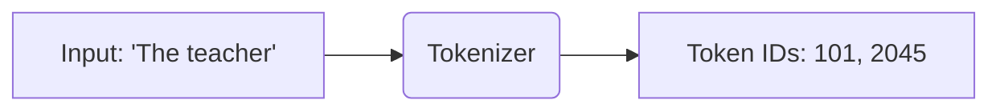
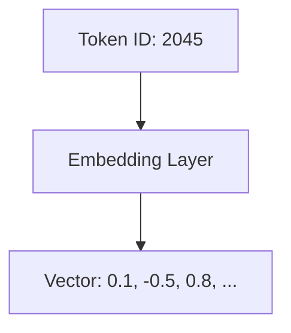
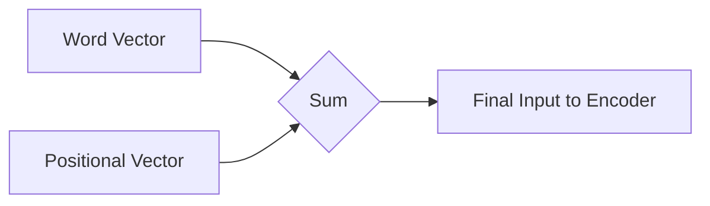
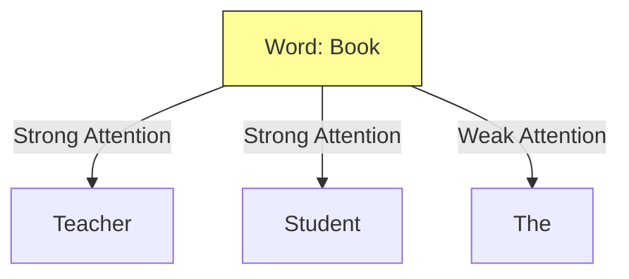
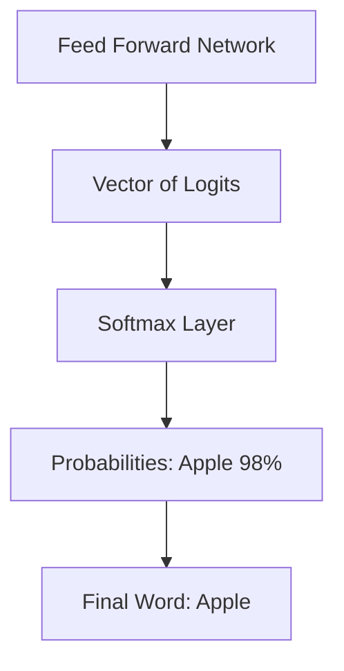
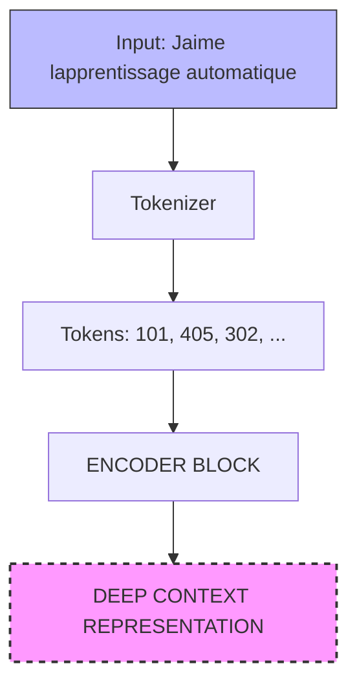
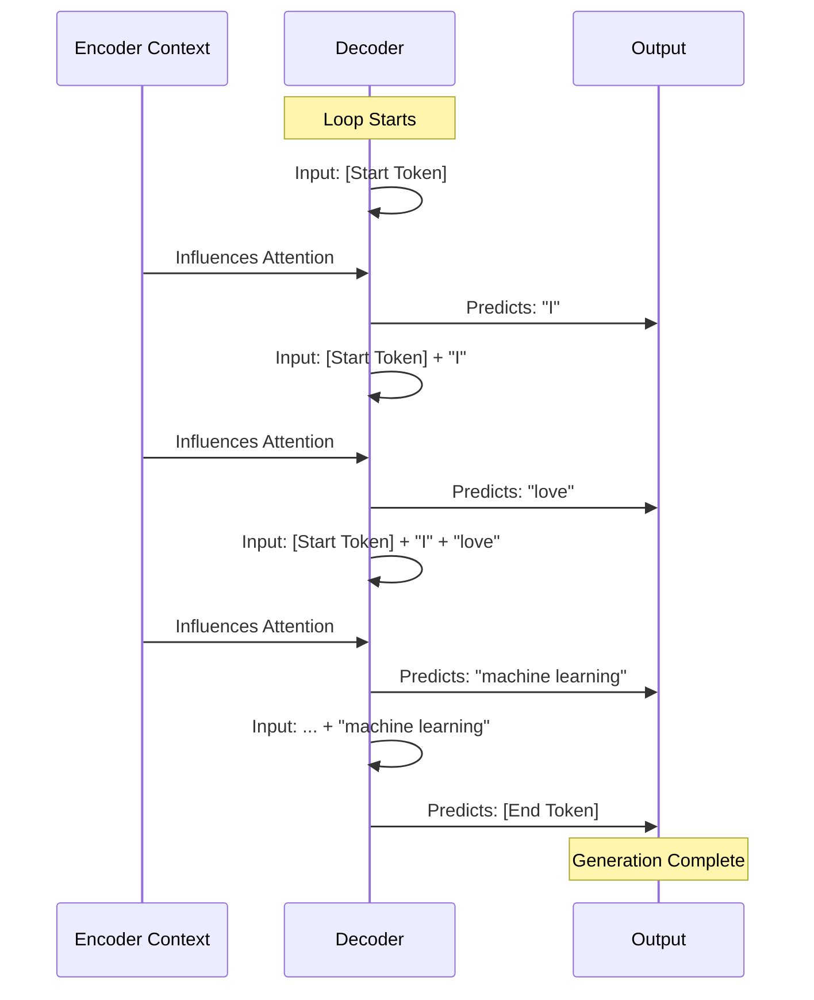

The release of the "Attention is All You Need" paper changed the landscape of Natural Language Processing (NLP) forever. It moved us away from Recurrent Neural Networks (RNNs) to the **Transformer** architecture, which powers the Generative AI explosion we see today.

But how does a Transformer actually "read" and "understand" a sentence?

In this post, we will walk through the architecture step-by-step, transforming raw text into understanding using the logic from the original paper.

## The High-Level View: Encoder and Decoder

At its highest level, the Transformer is a statistical calculator. It doesn't "know" English or Java; it knows math. The architecture is split into two distinct parts:

1.  **The Encoder:** Processes the input data.
2.  **The Decoder:** Generates the output.

They work in conjunction, though in modern models (like GPT), we often see decoder-only architectures. For this guide, we will follow the flow from Input (bottom) to Output (top).

---

## Step 1: Tokenization (Words to Numbers)

Machine learning models cannot process raw text. They need numbers. Before passing a sentence like *"The teacher has the book"* into the model, we must **tokenize** it.

### What is Tokenization?
Simply put, this converts words into numbers. Imagine a giant dictionary where every word has a unique ID.
* "The" -> 101
* "Teacher" -> 2045
* "Book" -> 3011

:::tip AI Terminology
**Tokenizer:** A tool that breaks text into smaller chunks (tokens). These can be whole words or parts of words. Ideally, if you train a model with a specific tokenizer, you must use the exact same one when generating text.
:::

---

## Step 2: Embeddings (Numbers to Meaning)

Now we have a list of numbers (IDs), but numbers don't have "meaning." To a computer, the number 100 and 101 are just close in value, but the words they represent might be totally unrelated.

We solve this with the **Embedding Layer**.

### The Concept: High-Dimensional Space
Each Token ID is matched to a **Vector** (a list of numbers). In the original paper, this vector size was 512.
* Imagine a 3D graph (X, Y, Z).
* Words with similar meanings are plotted physically close to each other in this space.
* "King" and "Queen" would be close together. "Apple" and "Car" would be far apart.

The model calculates the distance (often as an angle) between these words to understand their relationship mathematically.

---

## Step 3: Positional Encoding (Adding Order)

Transformers process input tokens in **parallel** (all at once), unlike RNNs which read word-by-word. This is great for speed, but it creates a problem: the model loses the concept of word order.

To the model, *"The teacher has the book"* and *"The book has the teacher"* look the same because the ingredients (words) are the same.

### The Fix: Positional Encoding
We add a "timestamp" or "position signature" to the word vectors.
* **Analogy:** Imagine throwing a stack of unnumbered pages into the air. If you don't write page numbers (positional encoding) on them first, you can't put the book back together.

---

## Step 4: Self-Attention (The Core Magic)

This is the "Attention" in "Attention is All You Need."

Once the vectors enter the model, the **Self-Attention Layer** analyzes the relationships between tokens. It allows the model to look at a specific word and understand its context based on *every other word* in the sentence.

### Example: "Who has the book?"
In the sentence: *"The teacher gave the book to the student."*
* The word **"Book"** needs to understand who has it (Teacher) and who receives it (Student).
* The attention mechanism creates strong connections (weights) between "Book," "Teacher," and "Student," while ignoring less relevant words like "the."

---

## Step 5: Multi-Head Attention (Many Perspectives)

The model doesn't just do self-attention once. It uses **Multi-Head Attention**.

### What is a "Head"?
Think of a "Head" as a different lens or filter. The model runs 12 to 100 of these heads in parallel. Each head learns a different aspect of language randomly during training.

* **Head 1 (The Grammar Lens):** Might focus on Subject-Verb agreement.
* **Head 2 (The Rhyme Lens):** Might focus on phonetics or poetry.
* **Head 3 (The Context Lens):** Might focus on relationships between people (Teacher/Student).

The results of all these heads are combined to give the model a complete understanding of the text.

---

## Step 6: The Output (Logits and Probabilities)

After passing through the Feed Forward Network, the model produces an output. But it doesn't output a word immediately; it outputs a **Vector of Logits**.

### Breaking Down the Jargon

1.  **Logits:** These are raw, unnormalized scores. The model scores every single word in its dictionary on how likely it is to be the next word.
    * *Example:* Apple: 5.0, Ball: 1.2, Cat: -3.0
2.  **Softmax Layer:** This turns those raw scores (Logits) into probabilities (Percentages).
    * *Example:* Apple: 98%, Ball: 1.9%, Cat: 0.1%

The word with the highest probability is selected as the predicted token.

---

## Putting It All Together: An End-to-End Example

We have looked at the components individually. Now, let's watch them work together in a real scenario.

**The Task:** Translate the French phrase *"J'aime l'apprentissage automatique"* into English.

### Phase 1: The Encoder (Reading & Understanding)

First, the model needs to understand the input. This happens entirely in the **Encoder**.

1.  **Tokenization:** The raw text is broken down into numbers.
2.  **Embedding & Position:** These numbers are turned into vectors with position information.
3.  **Multi-Head Attention:** The model analyzes the relationships. For example, it understands that *"apprentissage"* (learning) and *"automatique"* (machine) are strongly related in this context.
4.  **Deep Representation:** The output of the Encoder is not text, but a rich matrix of vectors that represents the *meaning* of the French sentence.

---

### Phase 2: The Decoder (Generating the Translation)

This is where the magic happens. The **Decoder** takes the "Deep Context" from the Encoder and generates the English translation one word at a time. This is a **loop**.

#### Step A: The Trigger
The process starts by feeding a special **Start-of-Sequence (SOS)** token into the Decoder.

#### Step B: The Prediction Loop
1.  The Decoder looks at the **Context** (from the Encoder) and the **Inputs so far** (initially just `<SOS>`).
2.  It runs Self-Attention to see what English words match the French meaning.
3.  It outputs probabilities via Softmax.
4.  The word with the highest score is selected: **"I"**.

#### Step C: The Feedback Loop
The model doesn't stop. It takes the new word (**"I"**) and feeds it back into the input. Now the input is `<SOS> + "I"`.
* *Cycle 2 Output:* **"love"**
* *Cycle 3 Output:* **"machine"**
* *Cycle 4 Output:* **"learning"**

#### Step D: The Stop Condition
Finally, the model predicts a special **End-of-Sequence (EOS)** token. This tells the system to stop generating.

---

## Transformer Variations: The Family Tree

While the example above used both the Encoder and Decoder (Sequence-to-Sequence), modern AI has branched into three distinct families based on which parts they keep.

| Type | Architecture | Best For | Popular Models |
| :--- | :--- | :--- | :--- |
| **Encoder-Only** | Inputs & Outputs are same length. | Classification, Sentiment Analysis, Entity Recognition. | **BERT** |
| **Encoder-Decoder** | Input & Output lengths vary. | Translation, Text Summarization. | **BART**, **T5** |
| **Decoder-Only** | Generates new tokens from a prompt. | General Text Generation (Chatbots, Code, Creative Writing). | **GPT-4**, **LLaMA**, **Bloom** |

---

## Summary

The Transformer architecture changed AI by allowing models to:
1.  Process data in parallel (Speed).
2.  Understand the context of every word relative to every other word (Attention).
3.  Learn multiple nuances of language simultaneously (Multi-Head).

This architecture is the foundation upon which tools like ChatGPT and Claude are built.

## References: 
1. https://arxiv.org/abs/1706.03762 
2. https://learn.deeplearning.ai